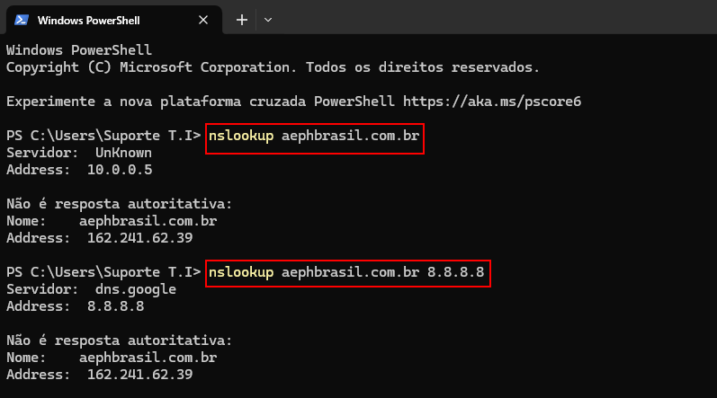
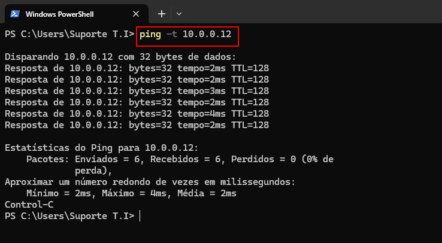
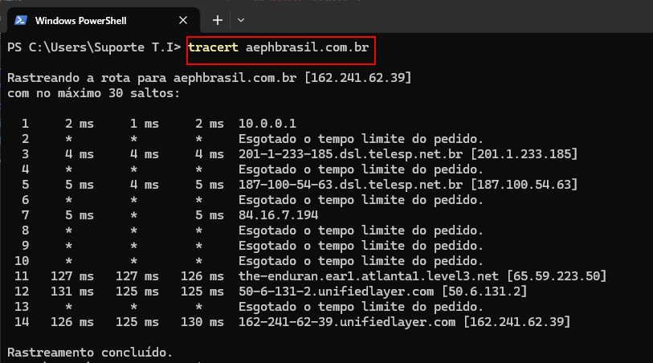
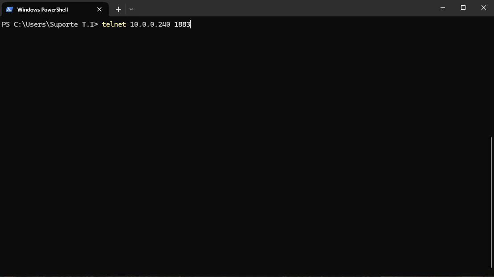

    

<b>Este projeto visa auxiliar o analista de T.I da AEPH do Brasil, com Comandos Úteis para resolução de chamados.</b>

<!-- Comentário exemplo -->

<h1 id="conteudo" style="font-size:35px;">📝 Conteúdo</h1>

- 
 <a href="#nslookup"> nslookup</a>

- 
 <a href="#ping"> ping</a>

- 
 <a href="#tracert"> tracert</a>

- 
 <a href="#telnet"> telnet</a>

<h1 id="nslookup">💻 Nslookup</h1>

Utilizamos o comando NSLOOKUP para verificar a resolução de DNS de um site, DDNs ou até mesmo um IP.
<i>

	nslookup DNS/IP
</i>

 

<h1 id="ping">💻 Ping</h1>

Utilizamos o comando Ping para verificar a resposta e latência entre hosts internos ou externos. Podemos utilizar também para sites.
<i>

	ping DNS/IP
</i>

 

<h1 id="tracert">💻 Tracert</h1>

Utilizamos o comando Tracert para verificar se há algum problema na rota com outro host. Podemos utilizar para IPs internos e externos, sendo possível também utilizar para DNS.
<i>

	tracert DNS/IP
</i>

 

<h1 id="telnet">💻 Telnet</h1>

Utilizamos o comando Telnet para testar a conectividade com serviços na rede, podendo ser interno ou externo. (O comando deve estar habilitado na máquina, através da tela de recursos do Windows.)
<i>

	telnet DNS/IP PORTA
</i>

 

- 
 <a href="#"> Voltar ao Topo</a>

 

- 
 <a href="../README.md"> Voltar para a página principal</a>
