

    

<b>Este projeto visa auxiliar o analista nas atividades relacionadas aos e-mails da AEPH do Brasil..</b>

<!-- Comentário exemplo -->

<h1 id="conteudo" style="font-size:35px;">📝 Conteúdo</h1>

- 
 <a href="#criacao"> Criação de E-mail</a>

- 
 <a href="#alteracao"> Alteração de E-mail</a>

- 
 <a href="#remocao"> Remoção de E-mail</a>

- 
 <a href="#backuphostgator"> Criação de Backup: E-mails (Hostgator)</a>

- 
 <a href="#limpezahostgator"> Limpeza de E-mail (Hostgator)</a>

- - 
 <a href="#extra"> Atividades Extras</a>

<h1 id="criacao">📧 Criação de E-mail</h1>

1. 
Acesse o <a href="https://sh-pro68.hostgator.com.br:2083/cpsess3949089252/frontend/paper_lantern/index.html?login=1&post_login=17936208941417">Hostgator</a> e efetue o login com os dados presentes no cofre de senhas (Keepass). 

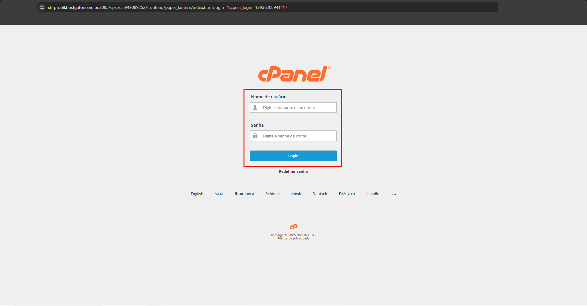

 

2. 
Na tela principal do <b style="color:white; background-color:black">CPanel</b>, procure pelo campo de <b style="color:white; background-color:black">Email</b> e selecione a opção: <b style="color:white; background-color:black">Contas de Email</b>

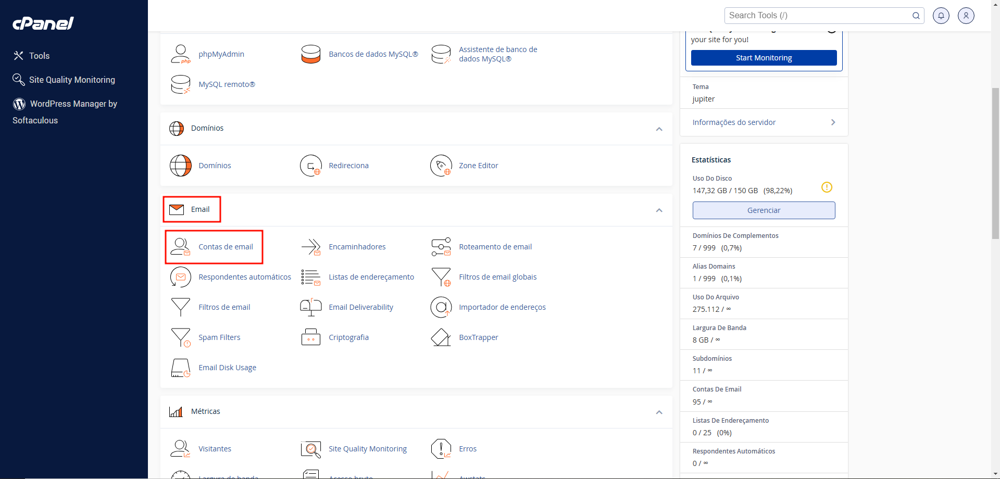

 

3. 
Verifique se está na tela de  <b style="color:white; background-color:black">Contas De Email</b>. Após confirmar, clique em <b style="color:white; background-color:black"> Criar</b>.

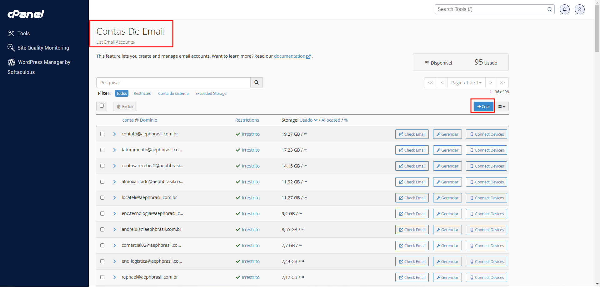

 

4. 
Na tela de criação de E-mail, devemos alterar o seguinte:
- <b style="color:white; background-color:black">Domínio</b> para <u><i><b style="color:white; background-color:black">aephbrasil.com.br</u></b></i>.

- Coloque o <i><b style="color:white; background-color:black">nome de usuário</b></i> de acordo com o solicitado, por padrão, é colocado o nome do departamento+numeral.

- Clique em <i><b style="color:white; background-color:black">Gerar</b></i> para que o sistema crie uma senha para a nova conta de e-mail.

- Em <b style="color:white; background-color:black">Optional Settings</b>, para ser exato, em <b style="color:white; background-color:black">Storage Space</b>, marque a opção: <b style="color:white; background-color:black"> Ilimitado</b>, para que não tenha limitação de espaço para a conta que está sendo criada.

Para finalizar, clique em <b style="color:white; background-color:black">Criar</b>.

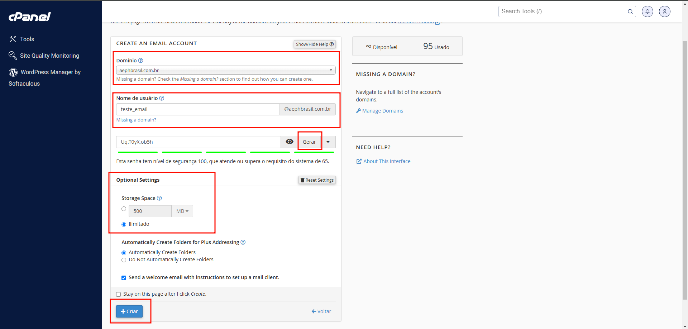

 

<h1 id="alteracao">📧 Alteração de E-mail</h1>

1. 
No campo de busca, procure pela conta que você deseja alterar, após localiza-la, clique em <b style="color:white; background-color:black">Gerenciar</b>. 

 

2. 
Confirme se está na tela de gerenciamento de conta de e-mail e com a conta correta selecionada. Após, faça a alteração que desejar, ou seja, altere a senha, mudar o tamanho de espaço alocado.

 

3. 
Após realizar as alterações, clique em <b style="color:white; background-color:black">Update Email Settings</b> para salvar as novas configurações.

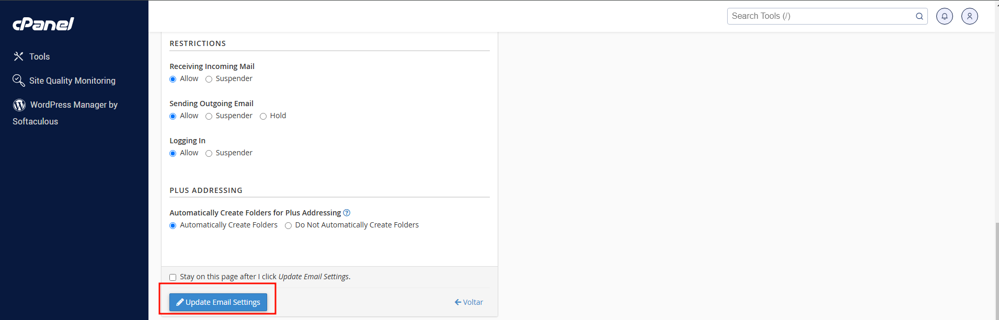

 

<h1 id="remocao">📧 Remoção de E-mail</h1>

1. 
No campo de busca, procure pela conta que você deseja excluir, após localiza-la, clique em <b style="color:white; background-color:black">Gerenciar</b>. 

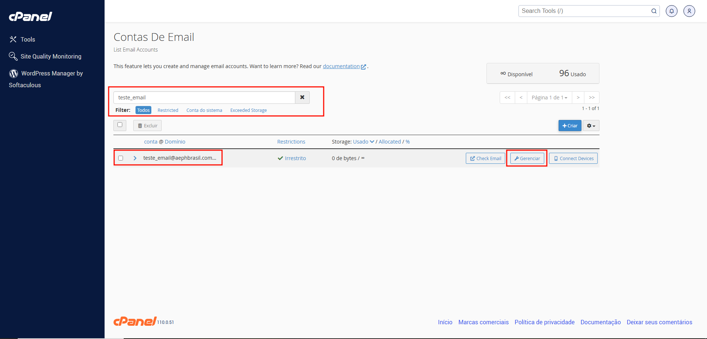

 

2. 
Confirme se está na tela de gerenciamento de conta de e-mail e com a conta correta selecionada. </b>. 

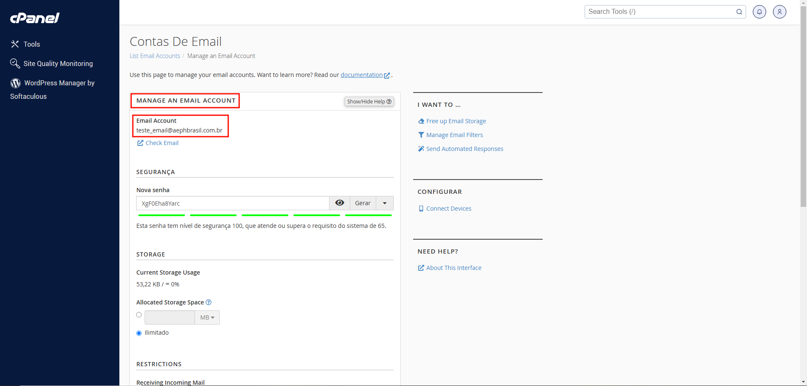

 

3. 
Desça toda a tela e procure por <b style="color:white; background-color:black">Delete Email Account</b> e clique na mesma. 

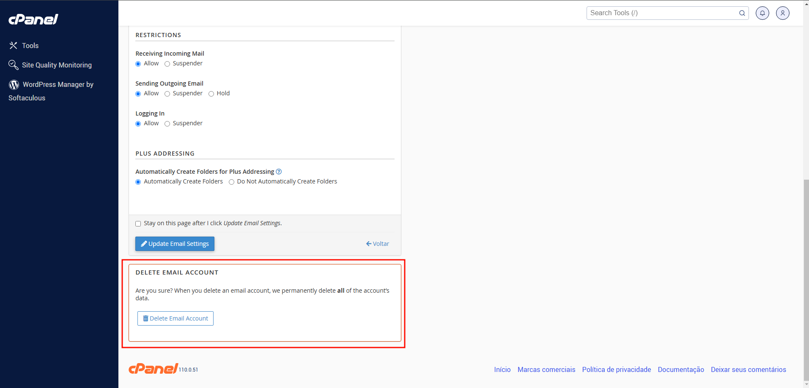

 

4. 
Será mostrado uma mensagem de alerta, para a confirmação de exclusão de e-mail. Para prosseguir, clique em  <b style="color:white; background-color:black">Excluir</b>. 

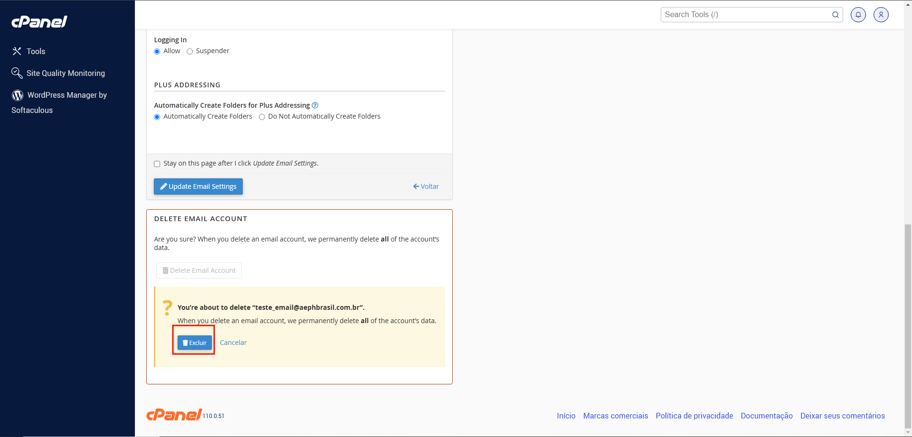

 

5. 
Por fim, será mostrado um aviso de conclusão de tarefa. 

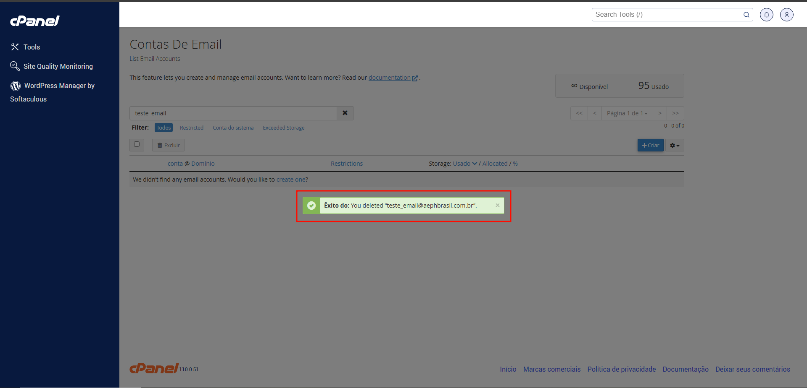

 

<h1 id="backuphostgator">📧 Criação de Backup: E-mails (Hostgator)</h1>

1. 
Na tela principal do cPanel, procure por Arquivos e selecione: <b style="color:white; background-color:black">Gerenciador de Arquivos</b>. 

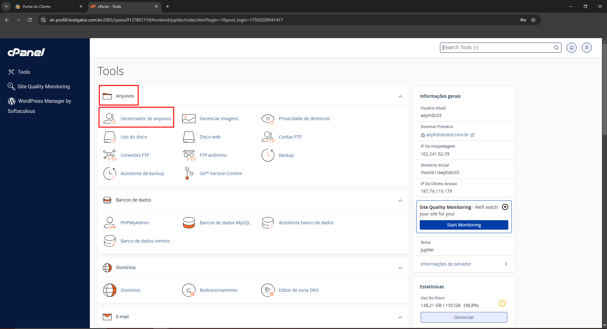

 

2. 
Com a tela de Gerenciamento de Arquivos aberta, na barra de busca, procure por <b style="color:white; background-color:black">mail</b> ou procure pela listagem de pastas e clique nela. 

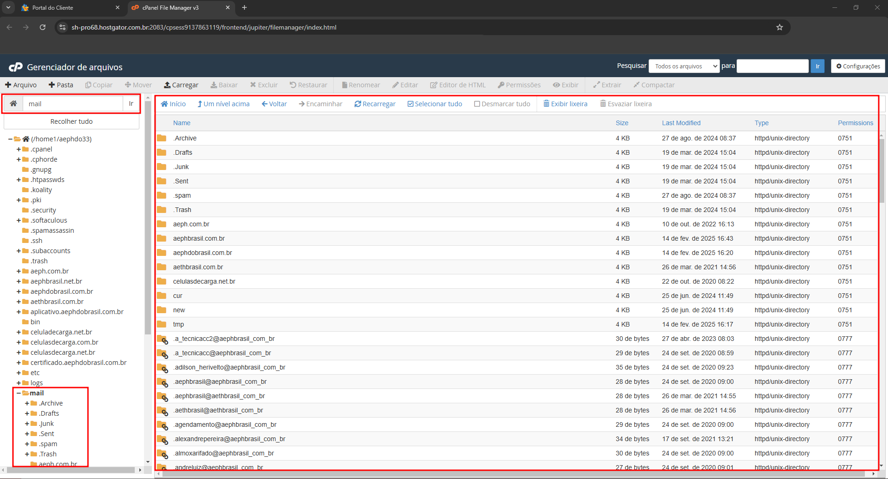

 

3. 
Na pasta com os e-mails, procure pela conta (ou pasta) que deseja criar o backup, após clique em <b style="color:white; background-color:black">compactar</b> no canto superior direito. 

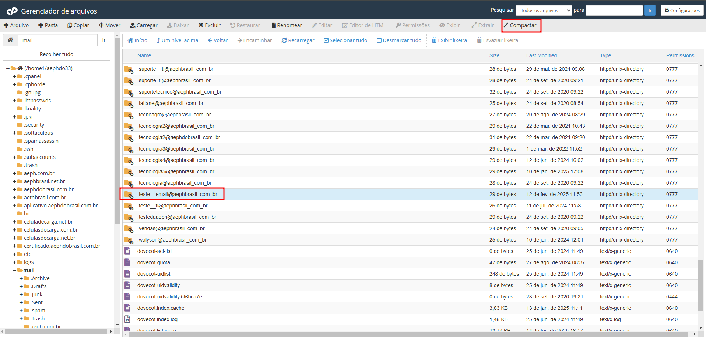

 

4. 
Será aberto uma janela com opções de Compactação, selecione o formato que quiser, confirme o caminho em que será salvo o backup. Terminando com <b style="color:white; background-color:black">Compress File</b>.

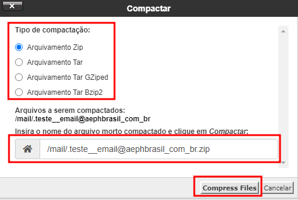

 

5. 
Após finalizado o processo, clique em <b style="color:white; background-color:black">Close.</b>.

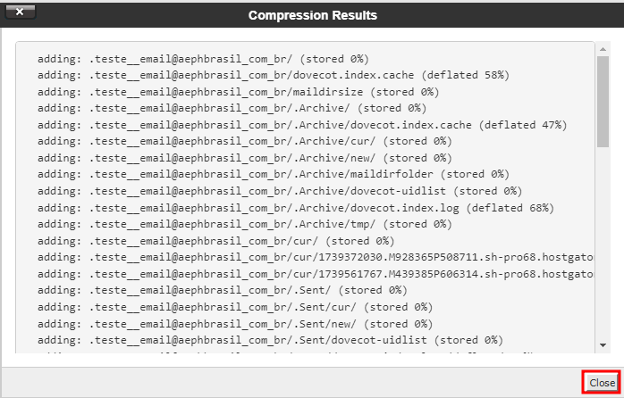

 

6. 
Localize o arquivo compactado, clique nele e após selecione <b style="color:white; background-color:black">Baixar.</b> no topo da página. Assim o backup será baixado para a sua máquina.

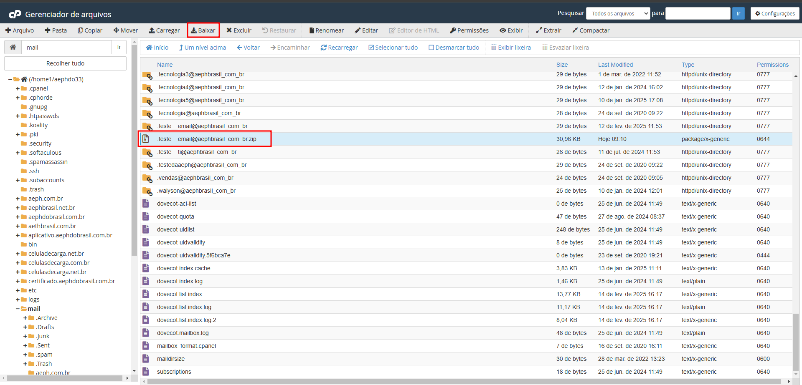

 

<h1 id="limpezahostgator">📧 Limpeza de E-mail (Hostgator)</h1>

1. 
Na tela principal do <b style="color:white; background-color:black">CPanel</b>, procure pelo campo de <b style="color:white; background-color:black">Email</b> e selecione a opção: <b style="color:white; background-color:black">Contas de Email</b>

 

2. 
Agora procure pelo e-mail que terá os arquivos limpados e clique em: <b style="color:white; background-color:black">Gerenciar</b>. 

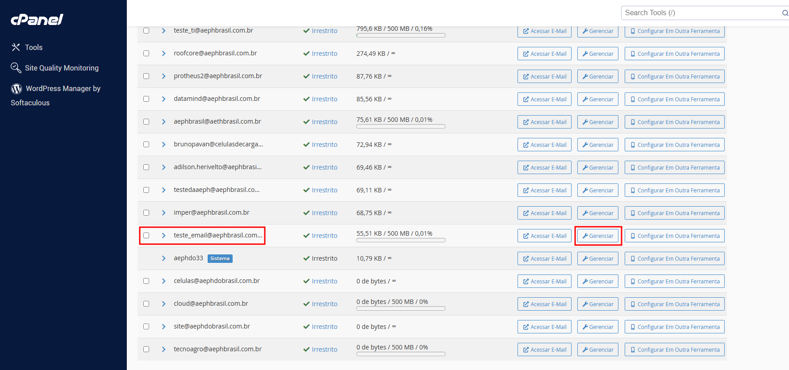

 

3. 
Certifique que está dentro da contra correta, após isso clique em: <b style="color:white; background-color:black">Alterar Armazenamento</b> no canto direito da tela, dentro de Eu Preciso Fazer.. 

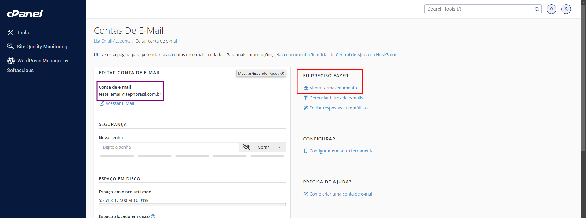

 

4. 
Verifique novamente se está dentro do e-mail correto, após, veja a pasta que será efetuada a limpeza, neste caso será a de Inbox, continue clicando em: <b style="color:white; background-color:black">Manage</b>. Com isso, será mostrado algumas opções, então selecione a que desejar. Finalize o processo de limpeza com, <b style="color:white; background-color:black">Deletar Permanentemente</b> e será mostrado uma mensagem de ação executada com sucesso.. 

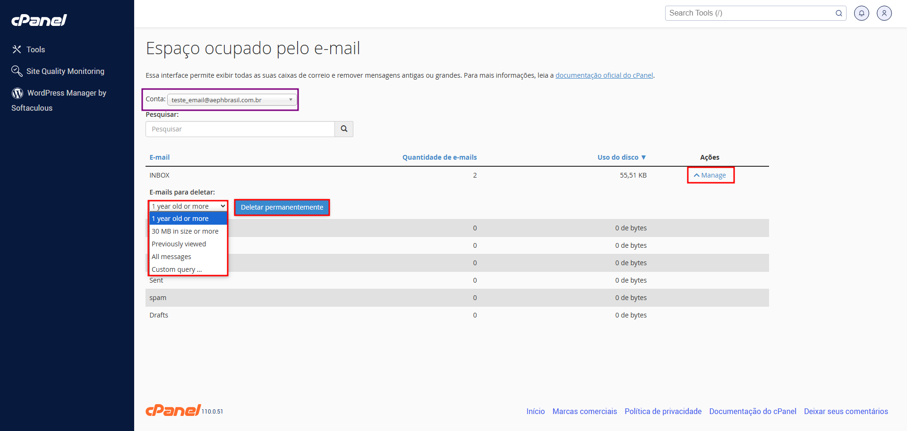
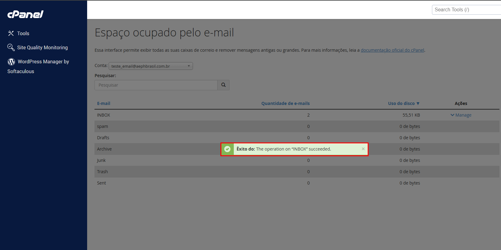

 

<h1 id="extra">📧 Atividades Extras</h1>

- 
 <a href="#addemailoutlook"> Adicionar Outra Conta de E-mail no Outlook</a>

 - 
 <a href="#alteraremailenvio"> Alterar Conta Que Irá Enviar o E-mail no Outlook</a>

<!--- 
 <a href="#addemailoutlook"> Adicionar Outra Conta de E-mail no Outlook</a>

- 
 <a href="#addemailoutlook"> Adicionar Outra Conta de E-mail no Outlook</a>
-->

<h2 id="addemailoutlook">📧 Adicionar Outra Conta de E-mail no Outlook</h2>

1.  
 Com o Outlook aberto, procure pela engrenagem no canto superior direito da tela e clique nela.

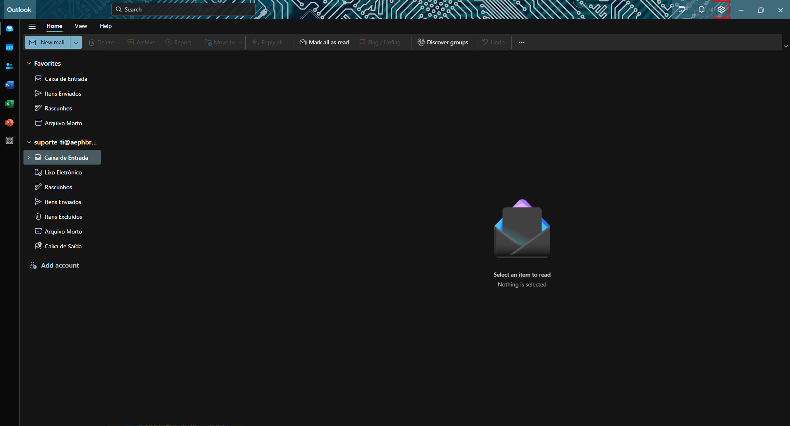

 

2.  
 Verifique se está na tela correta de Configurações e dentro da aba Contas. Após confirmação, clique em <b style="color:white; background-color:black">Adicionar Conta</b>. 

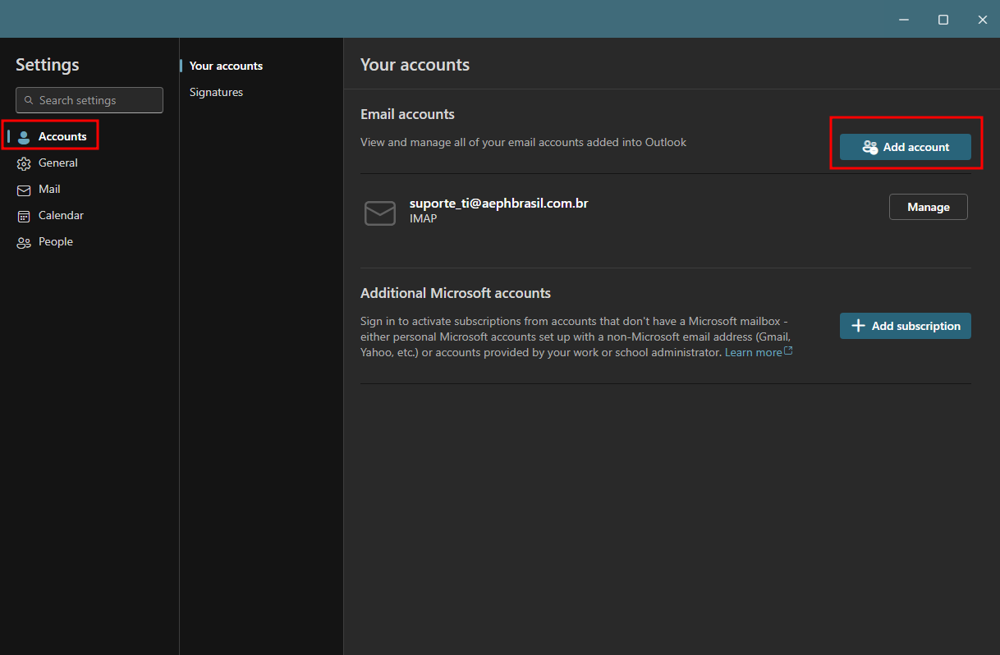

3.  
 Uma nova tela irá aparecer, então insira o e-mail a ser adicionado e clique em  <b style="color:white; background-color:black">Continuar</b>. 

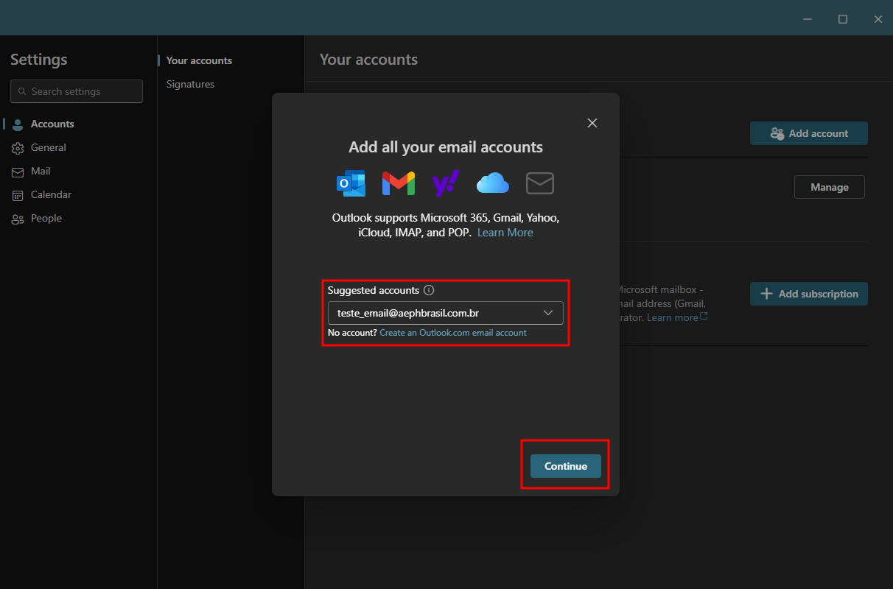

4.  
 Agora, será solicitado a senha do e-mail, digite-a e novamente clique em <b style="color:white; background-color:black">Continuar</b>. 

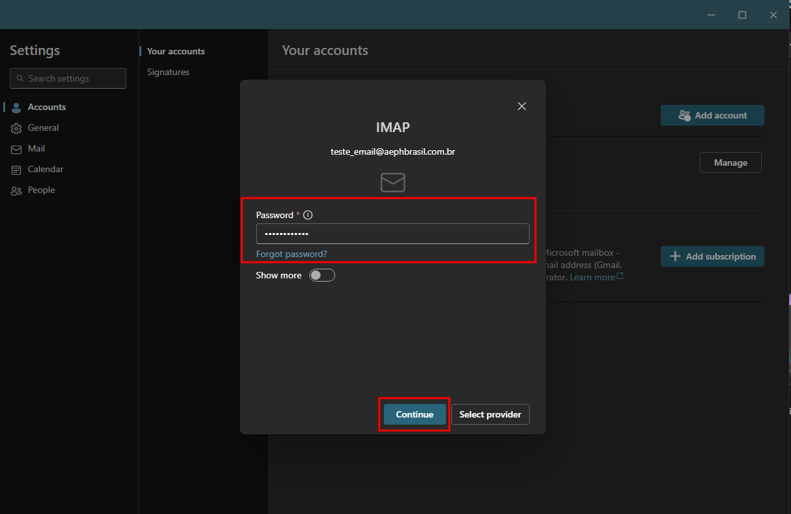

5.  
 Espere um pouco, enquanto o outlook valida as credenciais com o Hostgator, por fim, depois de validado, aperte em <b style="color:white; background-color:black">Continuar</b>. 

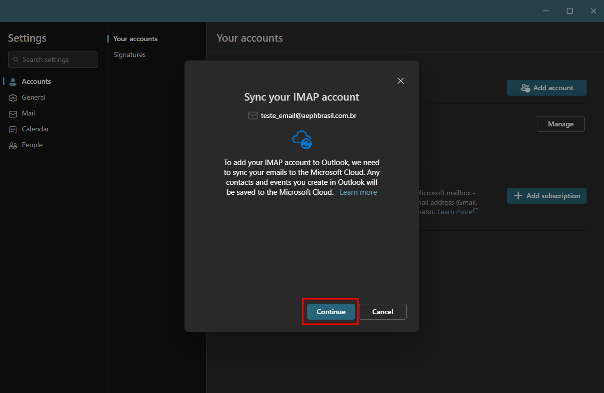

6.  
 Por fim, será mostrado uma tela de sucesso de adição de conta. E caso finalizado, basta clicar em <b style="color:white; background-color:black">Terminar</b> ou em <b style="color:white; background-color:black">Aidiconar Outra Conta</b> para colocar um outro e-mail. 

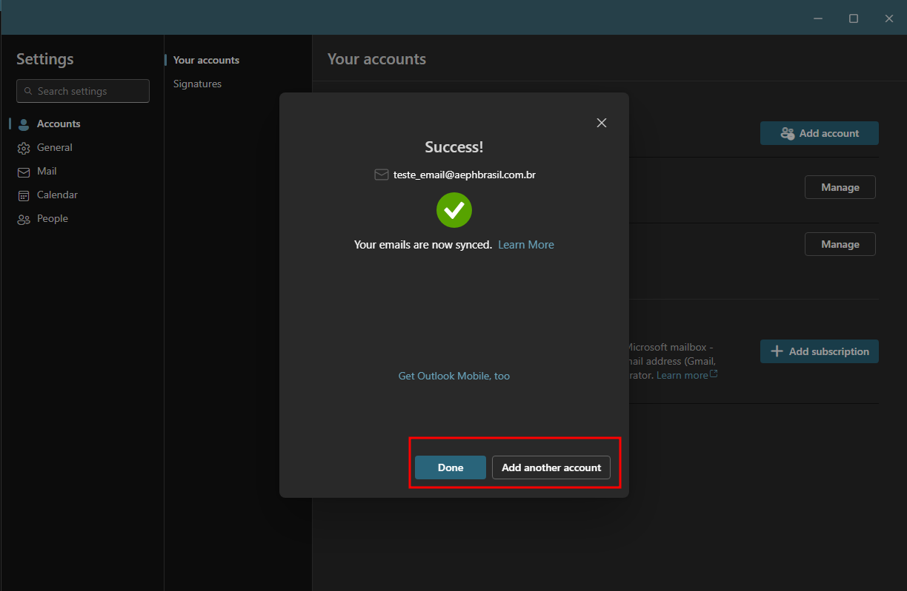

7.  
 Para validar a conta estará em conjunto com a outra na tela de <b style="color:white; background-color:black">Configurações: Contas</b>. 

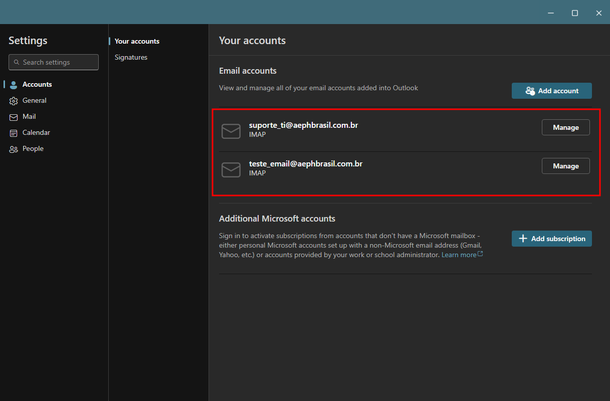

 

<h2 id="alteraremailenvio">📧 Alterar Conta Que Irá Enviar o E-mail no Outlook</h2>

1.  
 Para enviar o e-mail de um outlook, que tem mais de uma conta cadastrada. Vá em novo e-mail, clique onde está o e-mail de remetente que irá aparecer o outro e-mail.
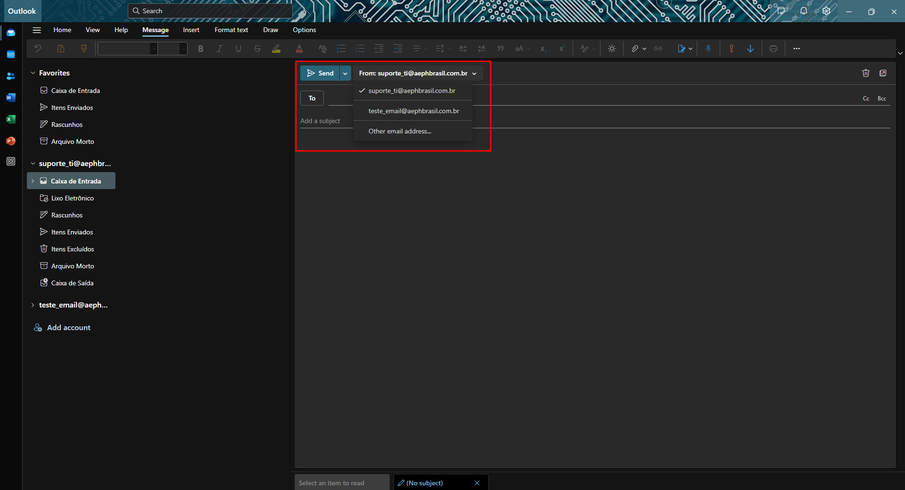

 

- 
 <a href="#"> Voltar ao Topo</a>

 

- 
 <a href="../README.md"> Voltar para a página principal</a>
