

    

<b>Este projeto visa auxiliar o analista nas atividades relacionadas ao Firewall da AEPH do Brasil.</b>

<h1 id="conteudo" style="font-size:35px;">📝 Conteúdo</h1>

- 
 <a href="#acessofirewall"> Acesso e Visão Geral do Firewall</a>

- 
 <a href="#firewallaliases"> Firewall: Aliases - Criar, Alterar e Ler "Apelidos"</a>

- 
 <a href="#firewallrules"> Firewall: Rules - Criar, Alterar e Ler Regras</a>

- 
 <a href="#firewallliveview"> Firewall: Logs - Live View</a>

- 
 <a href="#firewallrotas"> Firewall: Routes - Criação de Rotas Estáticas</a>

- 
 <a href="#firewallnats"> Firewall: NAT - Port Forward</a>

- 
 <a href="#firewwallgateway"> Gateway: Configuration - Criar, Alterar e Ler</a>

- 
 <a href="#firewwallgatewaygroup"> Gateway: Groups - Criar, Alterar e Ler</a>

<h1 id="acessofirewall">🛡️ Acesso e Visão Geral do Firewall</h1>

1. 
Para acessar a Dashboard do appliance, coloque o endereço abaixo no seu navegador e faça o login com as suas credenciais:

    https://10.0.0.1:8737

 

2. 
Agora no lobby principal do firewall, é possível ver as seguintes informações:

        1 - Menu de Navegação
        2 - Barra de Pesquisa
        3 - Informações do Sistema
        4 - Uso da Memória RAM
        5 - Uso do Disco 
        6 - Estatísticas da Interface 
        7 - Estatísticas das regras de Firewall 
        8 - Status dos Gateways de Internet
        9 - Status dos Serviços do Firewall
        10 - Gráfico de Trafego de Rede
        11 - Informações sobre a CPU
        12 - Avisos sobre o OPNSENSE
        13 - Edição da dashboard

OBS: Com a edição da dashboard, é possível mudar a disposição dos itens do lobby, até mesmo excluir ou adicionar outras informações.

 

<h1 id="firewallaliases">🛡️ Firewall: Aliases - Criar, Alterar e Ler "Apelidos"</h1>

1. 
Para acessar os Aliases do firewall, vá em:<b style="color:white; background-color:black"> Firewall --> Aliases</b>. Nesta tela, é possível identificar as seguintes informações:

        3 - Barra de Pesquisa
        4 - Filtragem por Tipo
        5 - Aumentar a quantidade de Aliases Exibidos
        6 - Ativar/Desativar Alias
        7 - Nome do Alias
        8 - Tipo de Alias
        9 - Descrição
        10 - Comandos: Editar, Duplicar, Excluir
        11 - Criar ou Deletar Alias
        12 - Importar/Exportar Aliases
        13 - Páginas
        14 - Aplicar

 

2. 
Para criar um novo alias, clique no botão de <b style="color:white; background-color:black">+ (Criar)</b>. Assim, será aberto uma janela, nela é possível definir o <b style="color:white; background-color:black"> Nome do Alias, Tipo de Alias, Conteúdo, Descrição.</b> Então, crie com as informações que desejar.

OBS: Caso vá criar um alias com DNS de sites, por exemplo, aeph.com.br utilize o alias de tipo <b style="color:white; background-color:black">HOST(s)</b>. Para IP ou um Range de IP, utilize a categoria <b style="color:white; background-color:black">NETWORK(s)</b>. Agora, se for utilizar portas, selecione o tipo de <b style="color:white; background-color:black">PORTS(s)</b>.

Exemplos: 

        HOST --> aeph.com.br ou www.aeph.com.br
        NETWORK --> 8.8.8.8/32 ou 10.0.0.0/24
        PORTS --> 8080 ou 1010:2000

Após criar a regra, clique em <b style="color:white; background-color:black">Save</b> e dê um <b style="color:white; background-color:black">Apply</b>.

 

<h1 id="firewallrules">🛡️ Firewall: Rules - Criar, Alterar e Ler Regras</h1>

1. 
Para acessar as regras de firewall do appliance, vá em: <b style="color:white; background-color:black"> Firewall --> Rules --> Interface</b>. 
        Para rede Local utilizar LAN
        Para operadoras utilizar a interface própria de cada uma

Nesta tela, é possível identificar as seguintes informações:

        4 - Ativada/Desativada, Tipo de Regra, Sentido da Regra
        5 - Protocolo Utilizado
        6 - IP/Rede/Alias Origem
        7 - Porta de Origem
        8 - IP/Rede/Alias Destino
        9 - Porta Destino
        10 - Gateway de Saída
        11 - Cronograma
        12 - Descrição
        13 - Comandos: Mover, Editar, Duplicar, Excluir
        14 - Criar ou Deletar Regras

 

2. 
 Na tela de Regras, clique no botão <b style="color:white; background-color:black">+ (Criar)</b>. Assim será aberto uma nova tela e preencha de acordo com a solicitação.

        1 - Ação: PASS --> LIBERAR / BLOCK --> NEGAR / REJECT --> NEGAR (Mais rápido)
        2 - Ativar/Desativar Regra
        3 - Interface
        4 - Direção da Regra (IN por Padrão)
        5 - Versão TCP/IP (IPV4 por Padrão)
        6 - Protocolo (Se souber pode definir, por exemplo, ICMP para ping)
        7 - IP/Rede/Alias Origem
        8 - IP/Rede/Alias Destino
        9 - Descrição
        10 - Cronograma
        11 - Gateway de Saída: DEFAULT --> GW PADRÃO, OPERADORA, Grupo De Gateway
        12 - Salvar

Após definir a regra, não se esqueça de clicar em <b style="color:white; background-color:black">Save</b> e dê um <b style="color:white; background-color:black">Apply</b> (que desta vez estará no canto superior direito da tela).

 

<h1 id="firewallliveview">🛡️ Firewall: Logs - Live View</h1>

Os logs são uma parte fundamental de um firewall, com eles você consegue entender o que está acontecendo não só com o equipamento, mas também com a sua rede.

<b style="color:white; background-color:black">"O Log fala com o analista!"</b>

No caso dos logs de firewall, poderemos analisar o tráfego de rede. Portanto, poderemos identificar bloqueios ou saber se "X" pacote está chegando ao destino.

1. 
Para visualizar os logs em camada de firewall, vá em: <b style="color:white; background-color:black"> Firewall --> Log Files --> Live View</b>. Nesta tela de logs, conseguimos identificar os seguintes pontos:

        4 - "Tema" para Filtragem
        5 - Condição
        6 - Ação/Valor
        7 - Adicionar Filtro
        8 - Atualização AoVivo de Logs / Resolver Hostnames
        9 - Quantidade de Logs Exibida
        10 - Interface
        11 - Horário
        12 - Origem - IP/Porta
        13 - Destino - IP/Porta
        14 - Protocolo
        15 - Rótulo

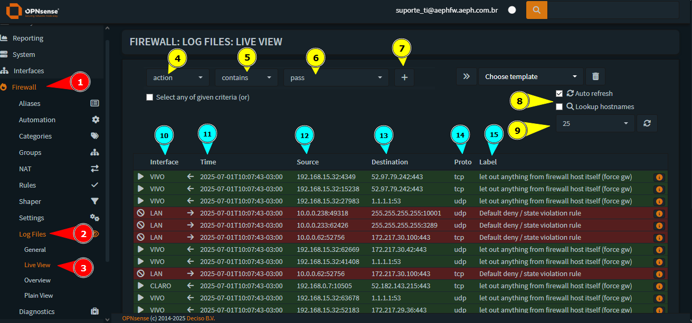

 

2. 
Então, para começar a filtrar os logs de firewall, podemos usar usar o seguinte exemplo: <b style="color:white; background-color:black">Filtrar tudo que está passando pela Interface de rede local, ou seja, LAN</b>. Com isso em mente, vamos definir o filtro da seguinte maneira:

        1 - "Tema" para Filtragem --> INTERFACE
        2 - Condição --> CONTAINS
        3 - Ação/Valor --> LAN

Finalize com <b style="color:white; background-color:black">+ (Criar).</b> Você poderá notar que só será mostrado os logs que sejam da interface LAN. Caso a interface fosse VIVO, seria mostrado apenas informações da WAN (VIVO).

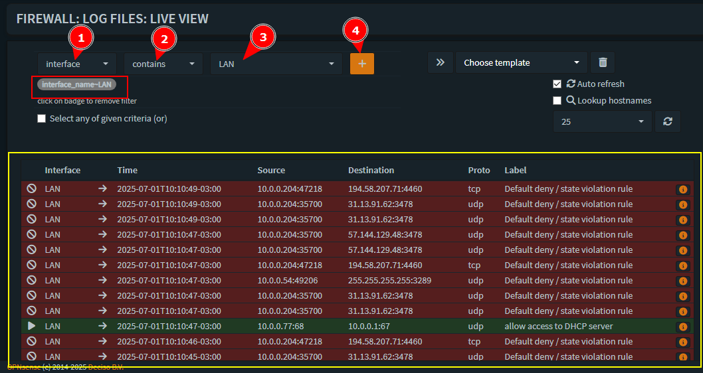

 

3. 
Agora, podemos pensar em outra condição <b style="color:white; background-color:black">Filtrar tudo da LAN e do IP 10.0.0.76.</b>. O termo de busca ficará assim:

        1 - "Tema" para Filtragem --> src (origem)
        2 - Condição --> is 
        3 - Ação/Valor --> 10.0.0.76

Realizando essa filtragem <b style="color:white; background-color:black">será mostrado tudo da LAN E do IP de final 76.</b> 

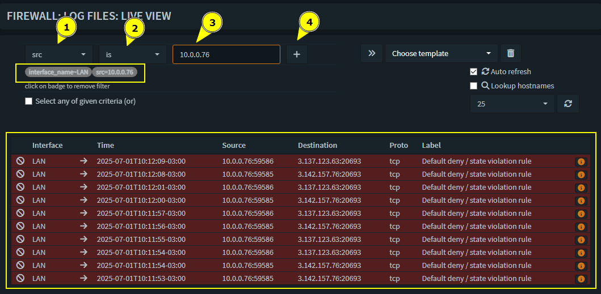

Caso queira que a condição do filtro deixe de ser "E" para "OU", basta clicar em <b style="color:white; background-color:black">Select any of given criteria (or)</b>. Assim será retornado ambas condições, se for da LAN e se for do IP 10.0.0.76.

<b style="color:white; background-color:black">Para retirar o filtro, basta clicar sobre o filtro que está no canto superior esquerdo em cinza.</b>

 

<h1 id="firewallrotas">🛡️ Firewall: Routes - Criação de Rotas Estáticas</h1>

<b style="color:white; background-color:black">Lembre-se ao criar uma rota estática, o acesso ao destino será feito exclusivamente pelo Gateway escolhido, ou seja, caso o GW escolhido venha ficar OFFLINE, o acesso não irá funcionar também, até que a rota seja desativada ou ajustada.</b>.

1. 
Para acessar as rotas, vá em: <b style="color:white; background-color:black">System: Routes: Configuration</b>. Nesta tela você poderá identificar os seguintes itens:

        4 - Barra de Busca
        5 - Aumentar a quantidade de Rotas Exibidas
        6 - Ativar/Desativar Rotas
        7 - Rede
        8 - Gateway de Saída
        9 - Descrição
        10 - Comandos: Editar, Duplicar, Excluir
        11 - Criar Rota
        12 - Páginas

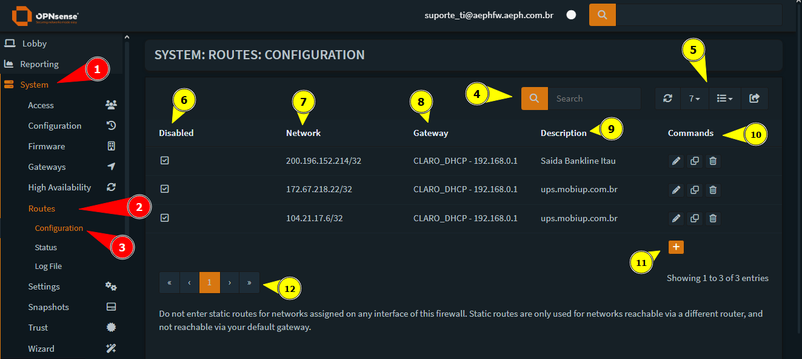

 

2. 
Para criar uma rota nova, clique em: <b style="color:white; background-color:black">+ (Criar)</b>. Após preencha os campos da seguinte maneira:

        DISABLED - Ativar/Desativar Rota
        NETWORK ADDRESS --> IP/RANGE de Destino
        GATEWAY --> Link Que A Rota Saíra
        DESCRIÇÃO --> Identificação da Rota

Não se esqueça de dar um <b style="color:white; background-color:black">Apply</b>, para que a rota comece a funcionar.
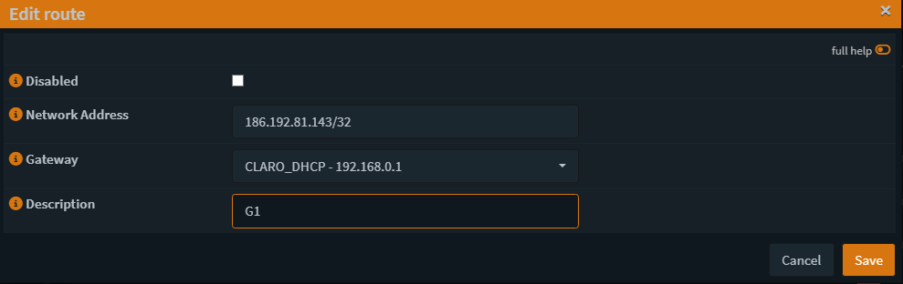
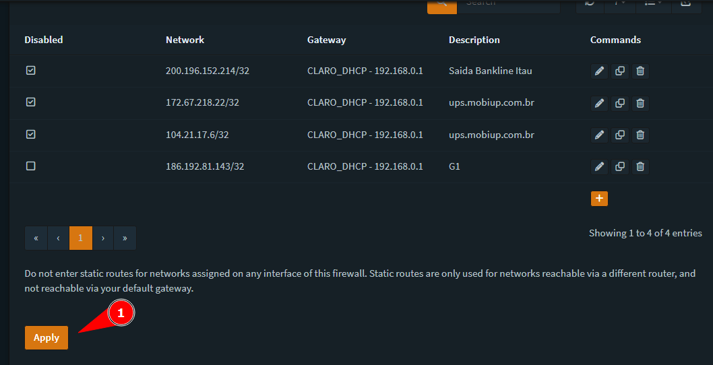

 

3. 
Para validar o funcionamento da rota estática, podemos utiizar o comando <b style="color:white; background-color:black">tracert</b>. Como pode ver no exemplo abaixo, a rota até o site do G1 estava ocorrendo pelo link da VIVO, mas após criação da rota, começou a sair pelo link da CLARO.

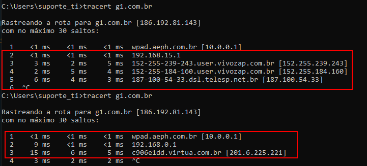

 

<h1 id="firewallnats">🛡️ Firewall: NAT - Port Forward</h1>

1. 
Para acessar os NATs, vá em: <b style="color:white; background-color:black">Firewall: NAT: Port Forward</b>. Nesta tela você poderá identificar os seguintes itens:</b>. 

        🔵
        4 - Ativada/Desativada, Tipo de Regra
        5 - Interface
        6 - Protocolo
        7 - IP/Rede/Alias Origem
        8 - Porta Origem
        9 - IP Interface Destino
        10 - Porta Destino
        11 - IP Redirecionamento
        12 - Porta Redirecionamento
        13 - Descrição Regra
        14 - Comandos: Criar, Mover, Editar, Duplicar, Excluir

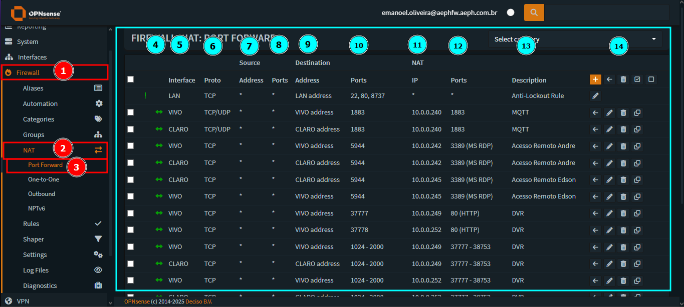

2. 
Então clicando no + para criar um NAT, devemos preencher as seguintes informações:

        1 - Interface Que Vai Receber o NAT
        2 - Versão do TCP/IP
        3 - Protocolo a ser utilizado
        4 - Caso a origem seja sempre especifica, pode adicionar um ou mais IPs (alias)
        5 - IP de interface
        6 - Porta Destino
        7 - IP Interno Que Vai Receber o Redirecionamento
        8 - Porta Que Vai Receber o Redirecionamento
        9 - Descrição
        10 - Salve

Não se esqueça de Aplicar as Mudanças!

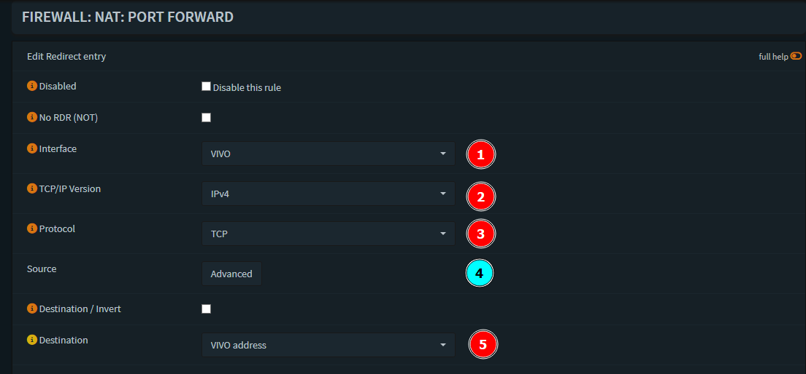
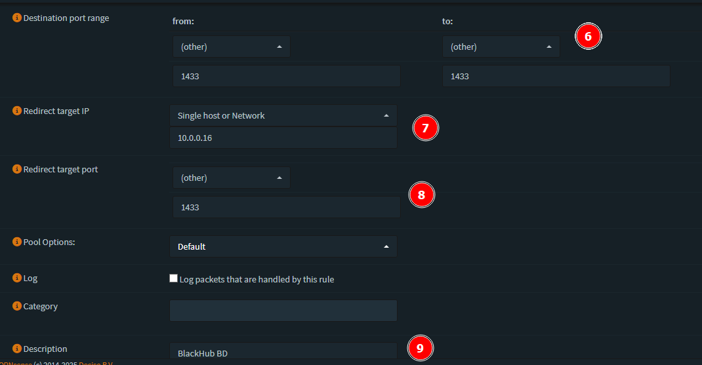
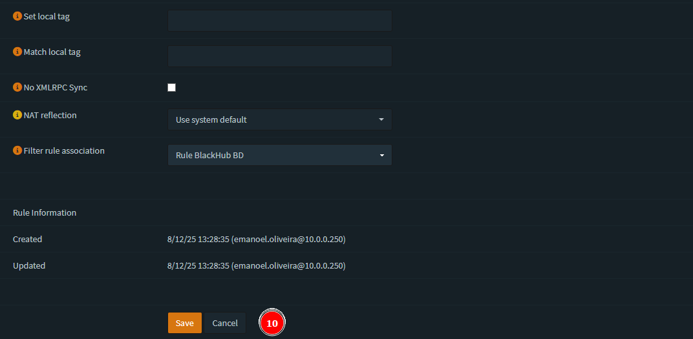

 

<h1 id="firewallgateway">🛡️ Gateway: Configuration - Criar, Alterar e Ler</h1>

1. 
Para acessar os gateways, vá em: <b style="color:white; background-color:black">System: Gateways: Configuration</b>. Nesta tela você poderá identificar os seguintes itens:</b>. 

        🔵
        4 - Nome Gateway
        5 - Interface
        6 - Protocolo
        7 - Prioridade
        8 - IP do Gateway
        9 - IP Monitor
        10 - Latência de Rede
        11 - Estabilidade de Rede
        12 - Perda de Pacote
        13 - Status
        14 - Descrição
        15 - Comandos: Criar, Mover, Editar, Duplicar, Excluir

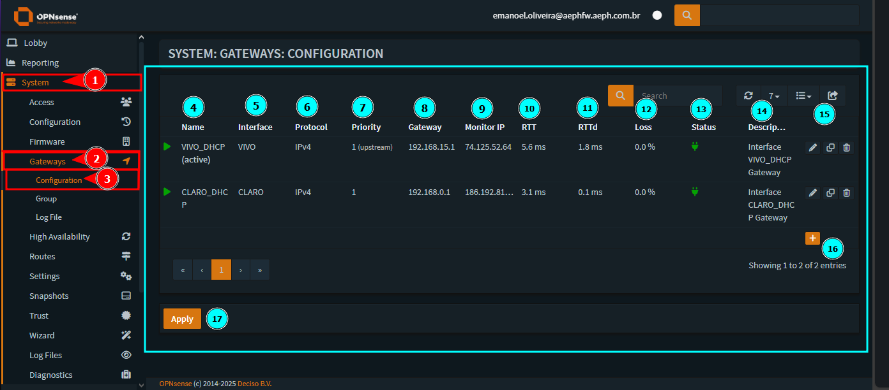

 

 2. 
Então clicando no + para criar um novo Gateway, devemos preencher as seguintes informações:

        1 - Nome
        2 - Descrição
        3 - Interface
        4 - Versão TCP/IP
        5 - Caso seja IP estático, coloque-o aqui
        6 - Definir como Link Principal
        7 - Desativar Monitoramento do Link
        8 - IP Monitor
        9 - Definir Gateway como Offline
        10 - Prioridade

Após salvar, não se esqueça de Aplicar as Mudanças!

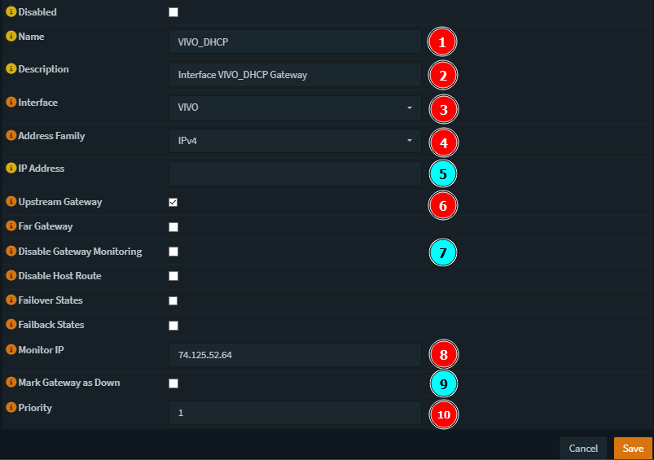

 

<h1 id="firewwallgatewaygroup">🛡️ Gateway: Groups - Criar, Alterar e Ler</h1>

1. 
Com os gateways devidamente criados, podemos associa-los em grupos, para isso acesse: <b style="color:white; background-color:black">System: Gateways: Configuration</b>. Nesta tela podemos identificar o seguinte:

        1 - Nome Grupo
        2 - Prioridade dos Gateways
        3 - Descrição
        4 - Comandos: Criar, Editar, Duplicar, Excluir

 

2. 
Então clicando no + para criar um novo Grupo, devemos preencher as seguintes informações:

        1 - Nome
        2 - Definir Prioridade (O Tier de Menor Valor Terá Prioridade)
        3 - Gatilho de Ação
        4 - Descrição
        5 - Salvar

Após salvar, não se esqueça de Aplicar as Mudanças!

Um ponto importante é no gatilho de ação, o ideal é deixar como "Member Down", pois o chaveamento entre links só ocorrerá quando o link de Tier Menor ficar Offline. Caso o link tenha alta latência, poderá chavear o tempo todo e atrapalhar a navegação.

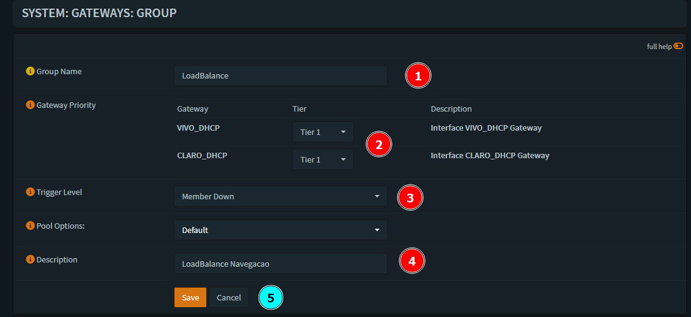
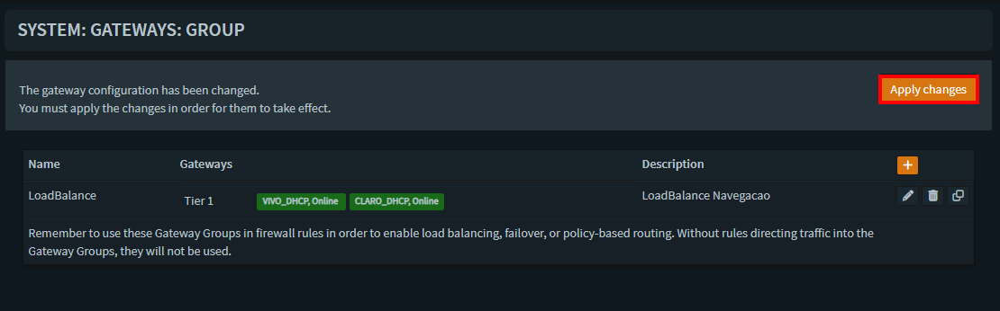

Além disso, note que deixamos ambos como Tier 1, pois ao adicionar o grupo de gateway em uma regra, os dois serão utilizados ao mesmo tempo. Portanto, neste caso chamamos essa configuração de LoadBalance. A imagem da regra abaixo, é um exemplo.
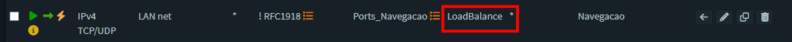

 

- 
 <a href="#"> Voltar ao Topo</a>

 

- 
 <a href="../README.md"> Voltar para a página principal</a>
