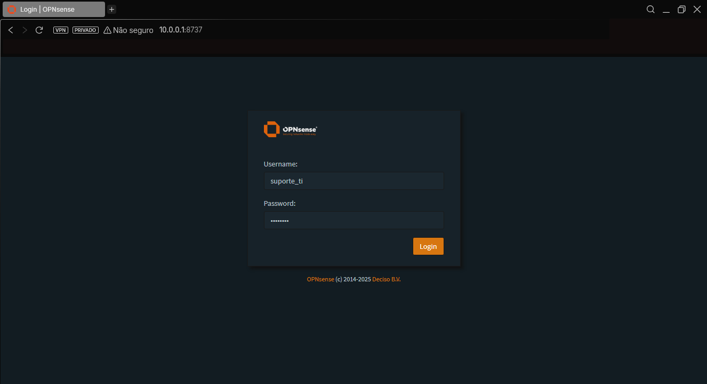
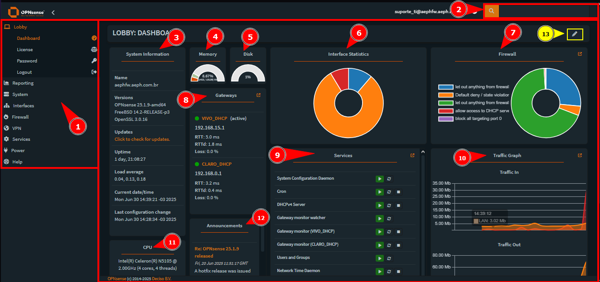
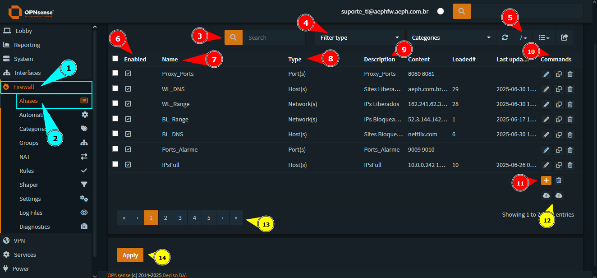
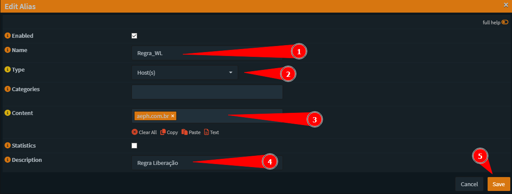
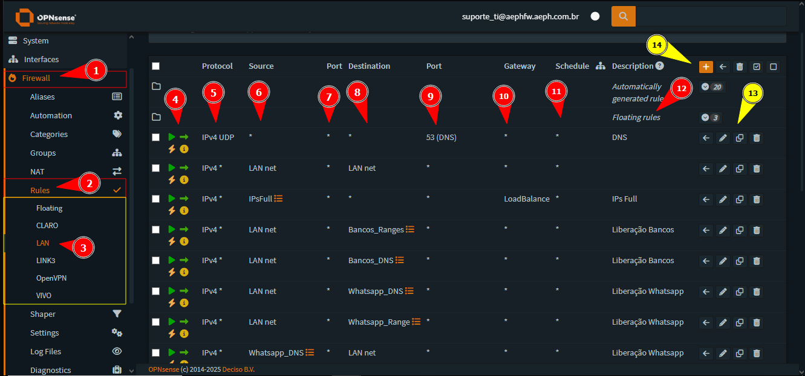
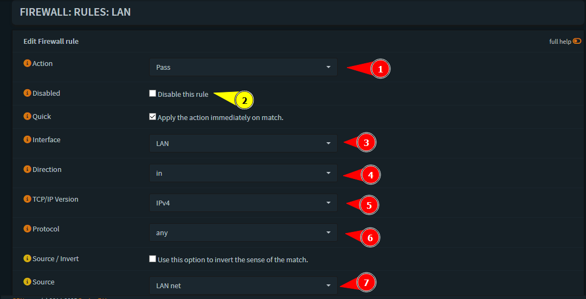
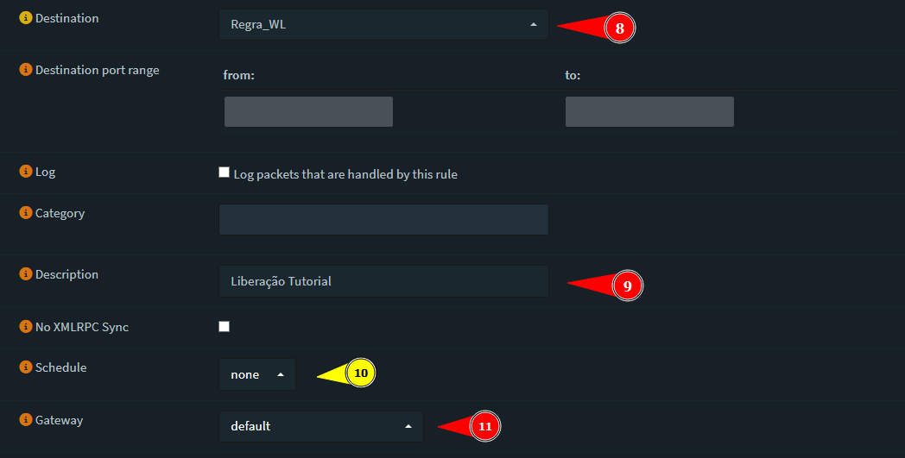
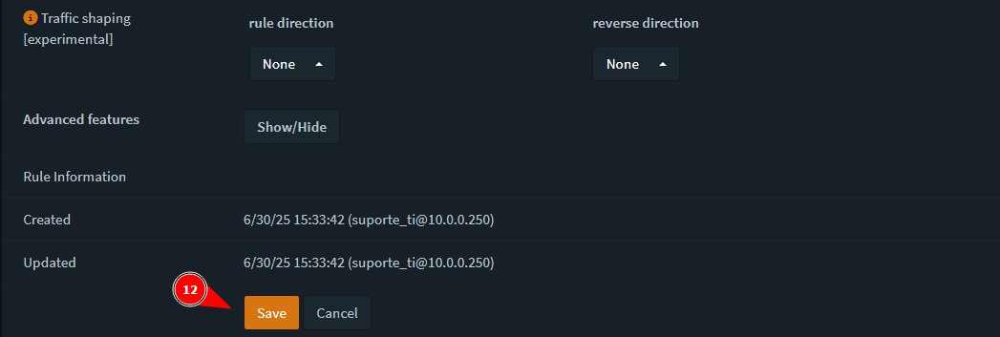
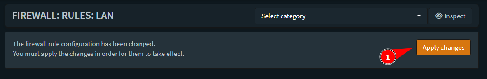

    

<b>Este projeto visa auxiliar o analista nas atividades relacionadas ao Firewall da AEPH do Brasil.</b>

<h1 id="conteudo" style="font-size:35px;">📝 Conteúdo</h1>

- 
 <a href="#acessofirewall"> Acesso e Visão Geral do Firewall</a>

- 
 <a href="#firewallaliases"> Firewall: Aliases - Criar, Alterar e Ler "Apelidos"</a>

- 
 <a href="#firewallrules"> Firewall: Rules - Criar, Alterar e Ler Regras</a>

<h1 id="acessofirewall">🛡️ Acesso e Visão Geral do Firewall</h1>

1. 
Para acessar a Dashboard do appliance, coloque endereço abaixo no seu navegador e faça o login com as suas credenciais:

    https://10.0.0.1:8737

 

2. 
Agora no lobby principal do firewall, é possível ver as seguintes informações:

    1 - Menu de Navegação
    2 - Barra de Pesquisa
    3 - Informações do Sistema
    4 - Uso da Memória RAM
    5 - Uso do Disco 
    6 - Estatísticas da Interface 
    7 - Estatísticas das regras de Firewall 
    8 - Status dos Gateways de Internet
    9 - Status dos Serviços do Firewall
    10 - Gráfico de Trafego de Rede
    11 - Informações sobre a CPU
    12 - Avisos sobre o OPNSENSE
    13 - Edição da dashboard

OBS: Com a edição da dashboard, é possível mudar a disposição dos itens do lobby, até excluir ou adicionar outras informações.

 

<h1 id="firewallaliases">🛡️ Firewall: Aliases - Criar, Alterar e Ler "Apelidos"</h1>

1. 
Para acessar os Aliases do firewall, vá em:<b style="color:white; background-color:black"> Firewall --> Aliases</b>. Nesta tela, é possível identificar as seguintes informações:

    3 - Barra de Pesquisa
    4 - Filtragem por Tipo
    5 - Aumentar a quantidade de Aliases Exibidos
    6 - Alias Ativa ou Desativada
    7 - Nome do Alias
    8 - Tipo de Alias
    9 - Descrição
    10 - Comandos: Editar, Duplicar, Excluir
    11 - Criar ou Deletar Alias
    12 - Importar/Exportar Aliases
    13 - Páginas
    14 - Aplicar

 

2. 
Para criar um novo alias, clique no botão de <b style="color:white; background-color:black">+ (Criar)</b>. Assim, será aberto uma janela, nela é possível definir o <b style="color:white; background-color:black"> Nome do Alias, Tipo de Alias, Conteúdo, Descrição.</b> Então, crie com as informações que desejar.

OBS: Caso vá criar um alias com DNS de sites, por exemplo, aeph.com.br utilize o alias de tipo <b style="color:white; background-color:black">HOST(s)</b>. Para IP ou um Range de IP, utilize a categoria <b style="color:white; background-color:black">NETWORK(s)</b>. Agora, se for utilizar portas, selecione o tipo de <b style="color:white; background-color:black">PORTS(s)</b>.

Exemplos: 

        HOST --> aeph.com.br ou www.aeph.com.br
        NETWORK --> 8.8.8.8/32 ou 10.0.0.0/24
        PORTS --> 8080 ou 1010:2000

Após criar a regra, clique em <b style="color:white; background-color:black">Save</b> e dê um <b style="color:white; background-color:black">Apply</b>.

 

<h1 id="firewallrules">🛡️ Firewall: Rules - Criar, Alterar e Ler Regras</h1>

1. 
Para acessar as regras de firewall do appliance, vá em:<b style="color:white; background-color:black"> Firewall --> Rules --> Interface</b>. 
        Para rede Local utilizar LAN
        Para operadoras utilizar a interface própria de cada uma

Nesta tela, é possível identificar as seguintes informações:

    4 - Ativada/Desativada, Tipo de Regra, Sentido da Regra
    5 - Protocolo Utilizado
    6 - IP/Rede/Alias Origem
    7 - Porta de Origem
    8 - IP/Rede/Alias Destino
    9 - Porta Destino
    10 - Gateway de Saída
    11 - Cronograma
    12 - Descrição
    13 - Comandos: Mover, Editar, Duplicar, Excluir
    14 - Criar ou Deletar Regras

 

2. 
 Na tela de Regras, clique no botão <b style="color:white; background-color:black">+ (Criar)</b>. Assim será aberto uma nova tela e preencha de acordo com a solicitação.

        1 - Ação: PASS --> LIBERAR / BLOCK --> NEGAR / REJECT --> NEGAR (Mais rápido)
        2 - Ativar/Desativar Regra
        3 - Interface
        4 - Direção da Regra (IN por Padrão)
        5 - Versão TCP/IP (IPV4 por Padrão)
        6 - Protocolo (Se souber pode definir, por exemplo, ICMP para ping)
        7 - IP/Rede/Alias Origem
        8 - IP/Rede/Alias Destino
        9 - Descrição
        10 - Cronograma
        11 - Gateway de Saída: DEFAULT --> GW PADRÃO, OPERADORA, Grupo De Gateway
        12 - Salvar

Após definir a regra, não se esqueça de clicar em <b style="color:white; background-color:black">Save</b> e dê um <b style="color:white; background-color:black">Apply</b> (que desta vez estará no canto superior direito da tela).

 

- 
 <a href="#"> Voltar ao Topo</a>

 

- 
 <a href="../README.md"> Voltar para a página principal</a>
