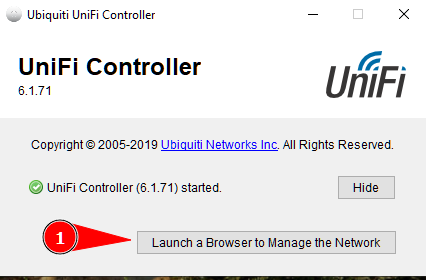
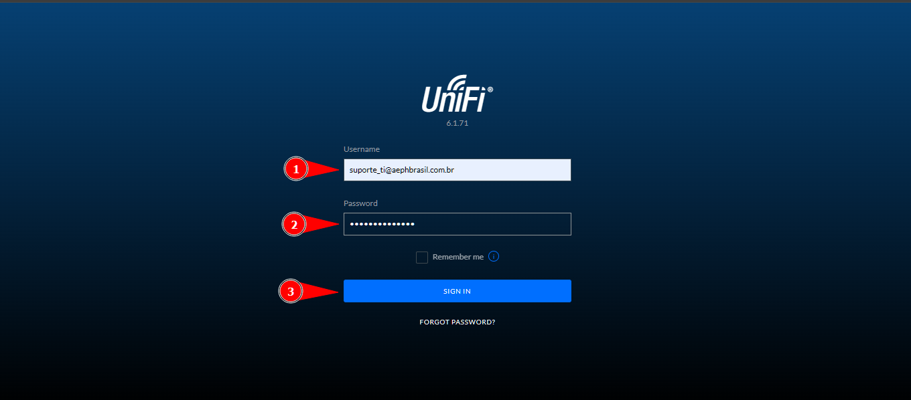
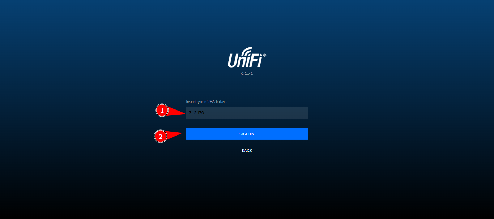
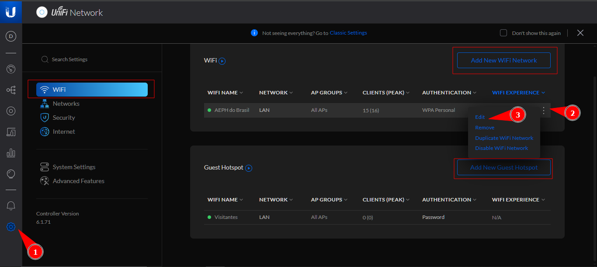
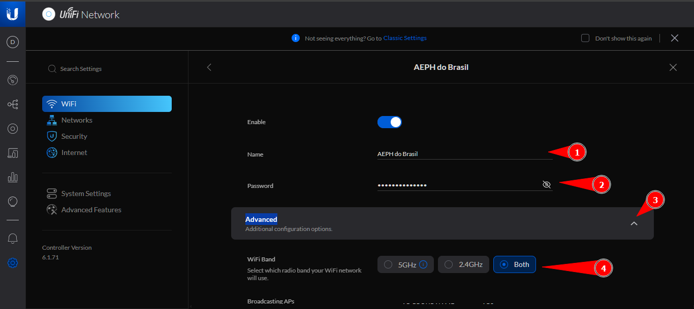
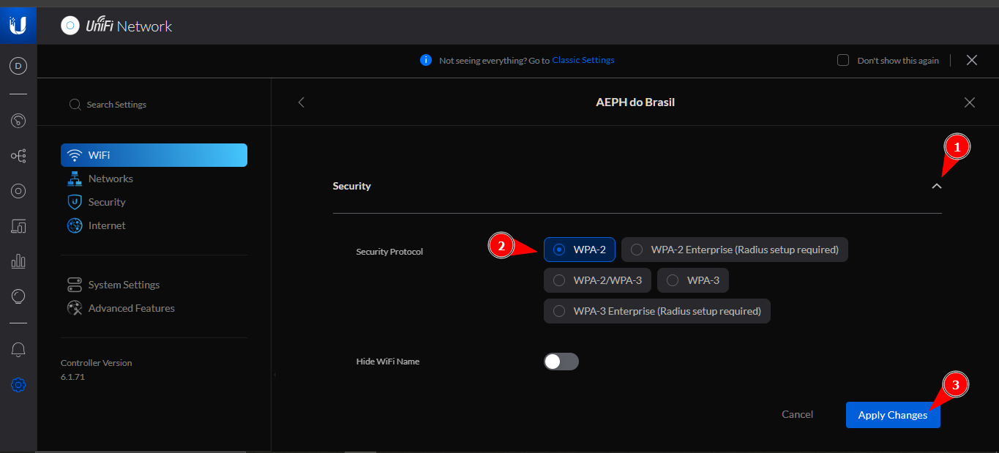

    

<b>Este projeto visa auxiliar o analista nas atividades relacionadas a infraestrutura da AEPH do Brasil.</b>

<h1 id="conteudo" style="font-size:35px;">📝 Conteúdo</h1>

- 
 <a href="#unifiwifi">Unifi: Wi-Fi</a>

 

<h1 id="unifiwifi">📶 Unifi: Wi-Fi</h1>

 <a href="#criarwificorp"> Unifi: Criar/Editar Wifi</a>

<!--
 <a href="#filesasterisk"> Too Many Open Files</a>
-->

<h2 id="criarwificorp">📶 Unifi: Criar/Editar Wifi</h2>

1. 
Acesse o <a href="https://ui.com/download/unifi">Link de Download</a> do <b style="color:white; background-color:black">UniFi Controller</b> e baixe a versão mais recente de acordo com o seu sistema operacional. 

1. 
Com o programa baixado e instalado, execute o mesmo. Após carregar, clique em <b style="color:white; background-color:black">Launch a Browser to Manage the Network</b> :

 

2. 
 Você será levado para uma tela de login da controladora, faça o login com as informações armazenadas no cofre de senhas. E pegue o código de 2FA no e-mail do suporte:

 

3. 
 Agora dentro da Controladora, clique na engrenagem para podermos editar as configurações do AP. Nessa tela, seramos levados diretamente para a tela de configuração de Wi-fi.
Nesta tela podemos visualizar, criar, editar ou deletar todas as redes wifi presentes no Unifi, podendo ser 'normais' ou para visitantes.

Localize a Rede Wifi que queremos editar, clique nos <b style="color:white; background-color:black">3 pontos</b>, após <b style="color:white; background-color:black">Edit</b>. Para  criar uma rede nova, basta clicar em: <b style="color:white; background-color:black">Add New WiFi Network</b>.

 

4. 
 Finalmente estaremos na tela de criação/edição de WiFi, então preencha os seguintes campos: <b style="color:white; background-color:black">Name, Password</b>. Agora expanda a opção, <b style="color:white; background-color:black">Advanced</b> e em <b style="color:white; background-color:black">WiFi Band</b>, marque a opção <b style="color:white; background-color:black">Both</b> para que seja propagado tanto a frequência 2.4GHz e 5GHz na mesma rede.
Agora desça um pocuo a pagína e procure e abra a aba <b style="color:white; background-color:black">Security</b> e em <b style="color:white; background-color:black">Security Protocol</b> marque a opção <b style="color:white; background-color:black">WPA-2</b>. Por fim, aplique as configurações e a rede será criada ou editada. 

 

- 
 <a href="#"> Voltar ao Topo</a>

 

- 
 <a href="../README.md"> Voltar para a página principal</a>
