

    

<b>Este projeto visa auxiliar o analista nas atividades relacionadas ao Mikrotik da AEPH do Brasil.</b>

<!-- Comentário exemplo -->

<h1 id="conteudo" style="font-size:35px;">📝 Conteúdo</h1>

- 
 <a href="#winbox">Winbox e o acesso ao Mikrotik</a>

- 
 <a href="#criarrede"> Criação de Interface e Rede</a>

- -  
 <a href="#criarredelan"> Criação de DHCP para LAN</a>

- -  
 <a href="#craltpppoe"> Criar ou Alterar Configuração PPPoe</a>

<h1 id="winbox">🧱 Winbox e o acesso ao Mikrotik</h1>

1. 
Acesse o <a href="https://mikrotik.com/download">Link de Download</a> do <b style="color:white; background-color:black">Winbox</b> e baixe a versão do software de acordo com o seu sistema operacional. 

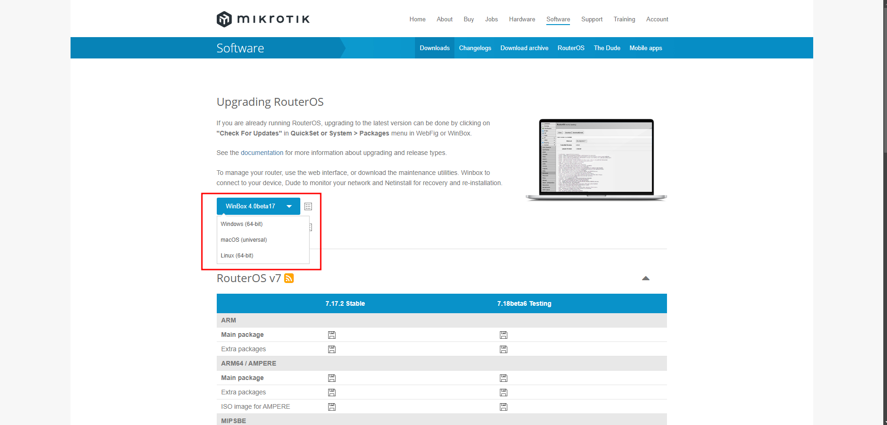

 

2. 
Com o download efetuado, coloque o arquivo <b style="color:white; background-color:black">WinBox_Windows.zip</b> onde desejar e realize o processo de unzip. Note que será gerado o aplicativo <b style="color:white; background-color:black">Winbox</b> já disponível para uso. 

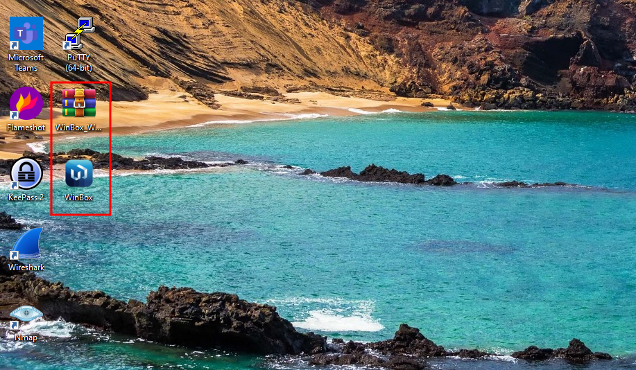

 

3. 
Com o Winbox aberto, já será mostrado o Mikrotik disponível para acesso. Então, para acessa-lo, <b style="color:white; background-color:black">selecione-o ou digite manualmente o endereço</b>. Após coloque o login e senha (disponíveis no keepass) e clique em conectar.

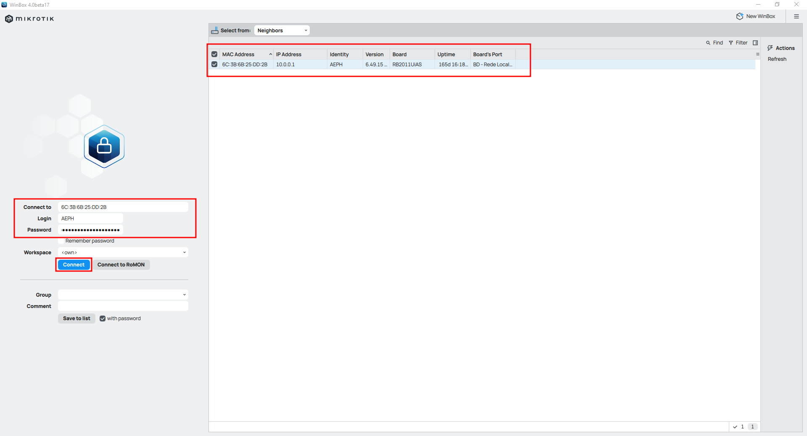

 

- 3.1 Por padrão, pode ser que o firewall do Windows pergunte, se será liberado o acesso do Winbox a rede do domínio, para liberar o acesso, basta clicar em <b style="color:white; background-color:black">Permitir acesso</b> e seguir com o passo anterior.  

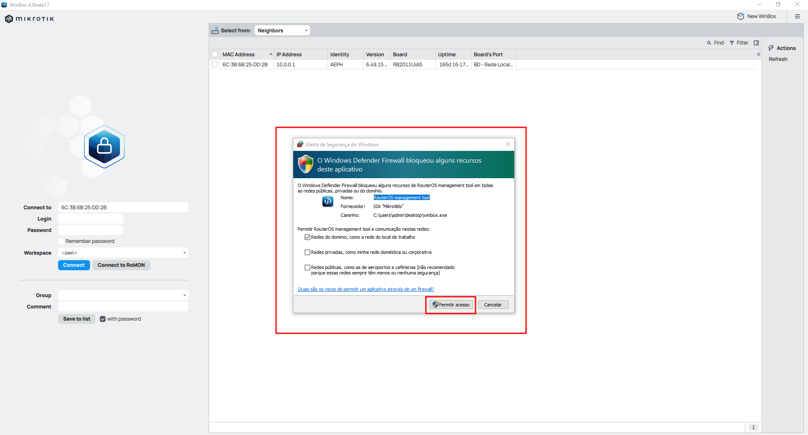

 

<h1 id="criarrede">🧱 Criação de Interface e Rede</h1>

1. 
Para criar o tipo de interface, vá em <b style="color:white; background-color:black">Interfaces: Interface: New</b> e selecione o tipo de interface que deseja criar, no caso será <b style="color:white; background-color:black">Ethernet</b>.

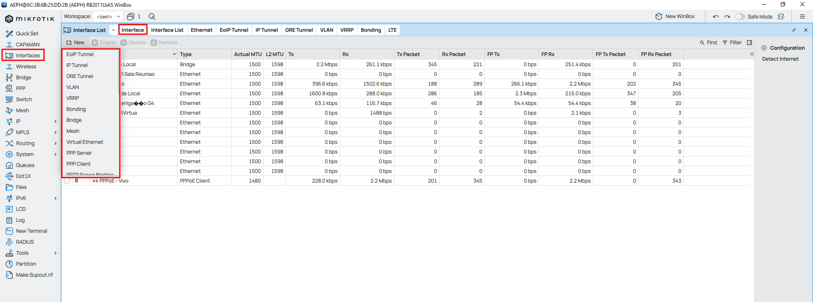

 

2. 
Ainda em <b style="color:white; background-color:black">Interfaces</b> vá em <b style="color:white; background-color:black">Interface List: New</b> para criarmos uma nova interface. Neste caso, vamos nomea-la e selecionar o (tipo) interface criada no passo anterior e dê um <b style="color:white; background-color:black">Apply, Ok.</b>

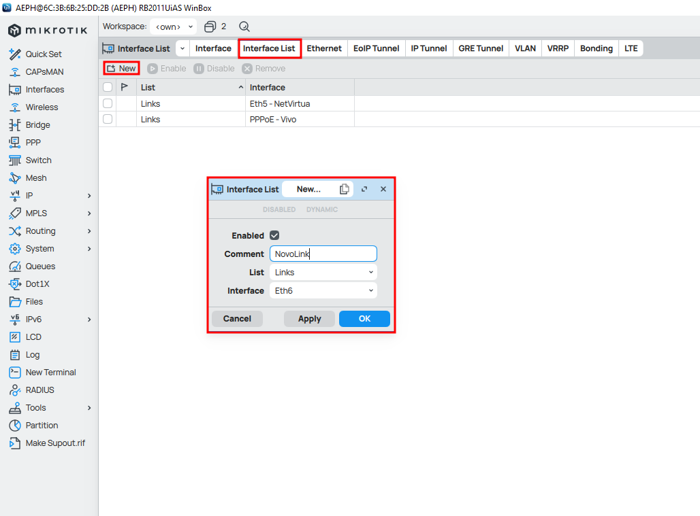

 

3. 
Agora vá em <b style="color:white; background-color:black">IP: Addresses: New</b> e preencha os campos com o <b style="color:black; background-color:white">Nome, IP designado+máscara de rede, IP de rede e a interface</b>. Após dê <b style="color:white; background-color:black">Apply, Ok.</b>

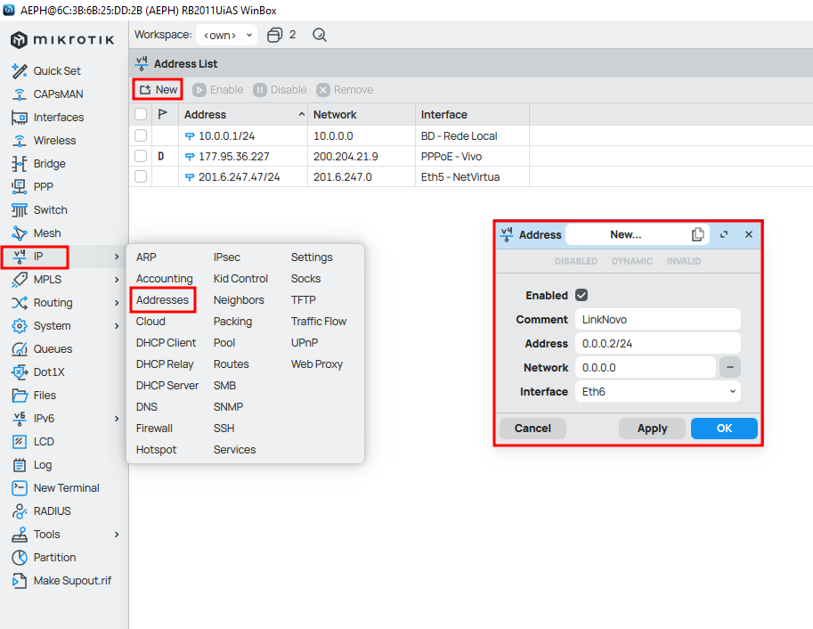

 

4. 
Indo em <b style="color:white; background-color:black">IP: Routes: New</b> preencha os campos com o <b style="color:black; background-color:white">Nome, 0.0.0.0/0 (para definir qualquer destino) e gateway</b>. Após dê <b style="color:white; background-color:black">Apply, Ok.</b>

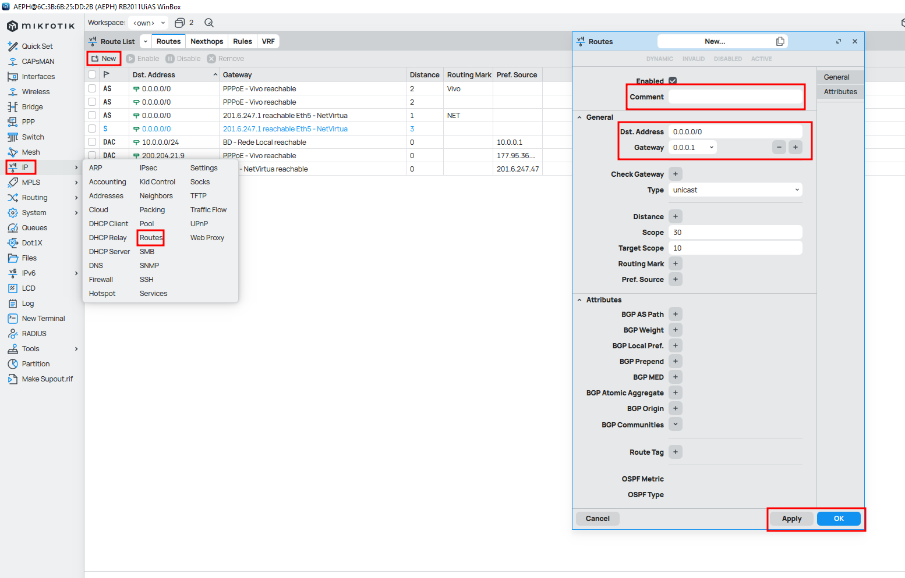

 

5. 
 Vá para <b style="color:white; background-color:black">IP: Firewall: NAT: New</b> para podermos criar um NAT se saída, com objetivo de mascarar o IP da rede.

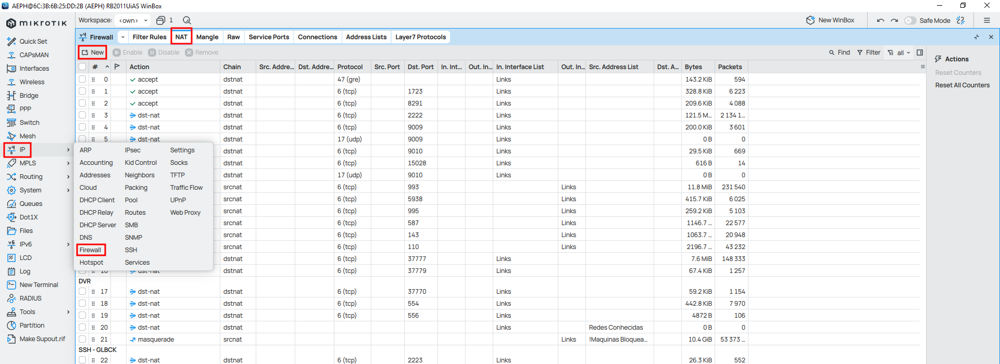

 

6. 
 Com a aba aberta, preencha os campos com <b style="color:black; background-color:white">Nome Regra, srcnat, InterfaceCriada, Masquerade</b>, após finalize com <b style="color:white; background-color:black">Apply, Ok.</b>

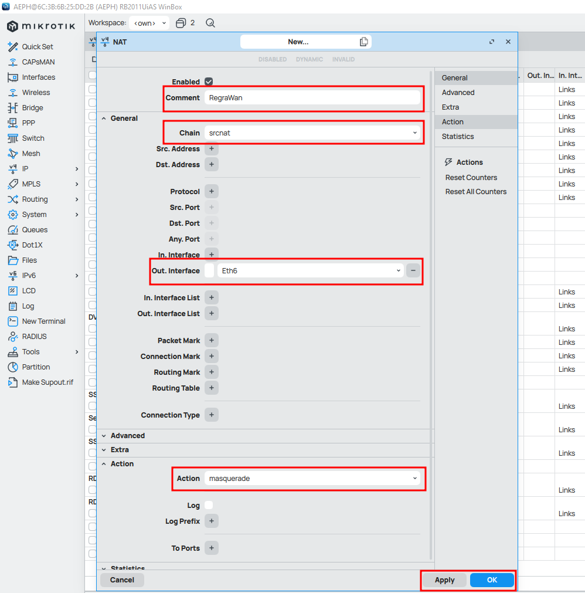

 

<h2 id="criarredelan">🧱 Criação de DHCP para LAN</h2>

 

1. 
 Para criar um servidor de DHCP para a rede local, vá em <b style="color:white; background-color:black">IP: DHCP Server: Networks</b>, preencha as informações com os dados que tiver, após finalize com <b style="color:white; background-color:black">Apply, Ok.</b>

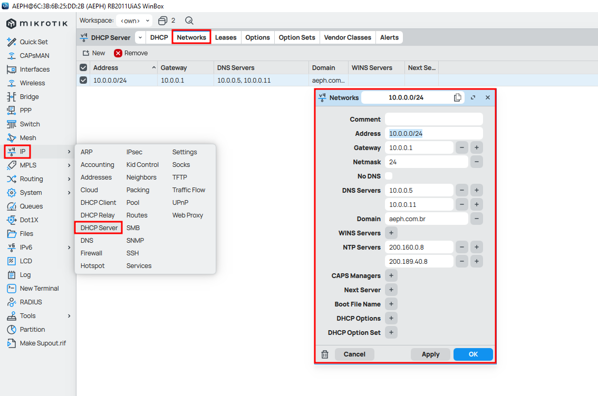

 

1. 
 Ainda em DHCP Server, vá em <b style="color:white; background-color:black">DHCP: New</b>, preecnha as informações com o <b style="color:black; background-color:white">nome da Rede, InterfaceCriada, TempoDeLease, PoolDeDHCP (criado no passo anterior)</b> e por fim, marque a opção: <b style="color:black; background-color:white">Add ARP For Leases</b>, finalizando com, <b style="color:white; background-color:black">Apply e Ok.</b>

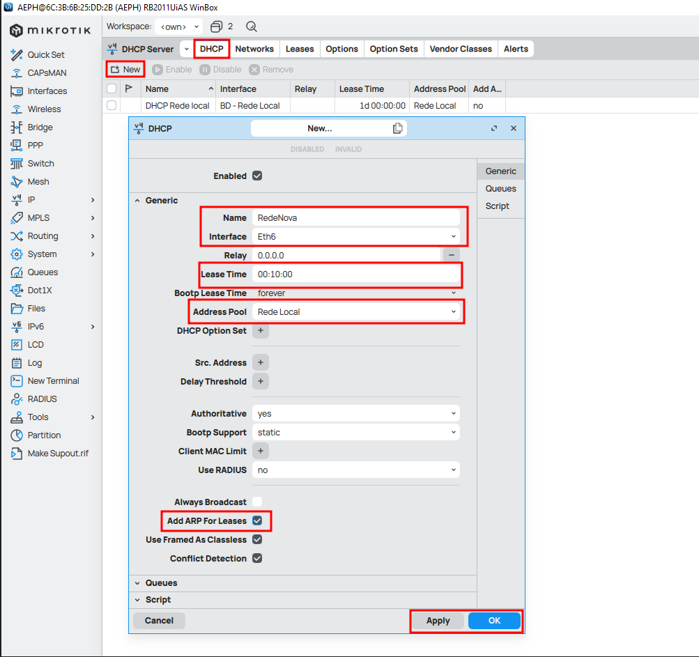

 

<h2 id="craltpppoe">🧱 Criar ou Alterar Configuração PPPoe</h2>

 

1. 
 Para criar ou alterar uma conexão PPPoe, vá em <b style="color:white; background-color:black">PPP: INTERFACES</b>, sendo que para criar um novo, clique em <b style="color:white; background-color:black">New</b>, para alterar um já existente, dê duplo click no mesmo, assim preenchendo as informações passadas pela provedora de internet, terminando com <b style="color:white; background-color:black">Apply, Ok.</b>

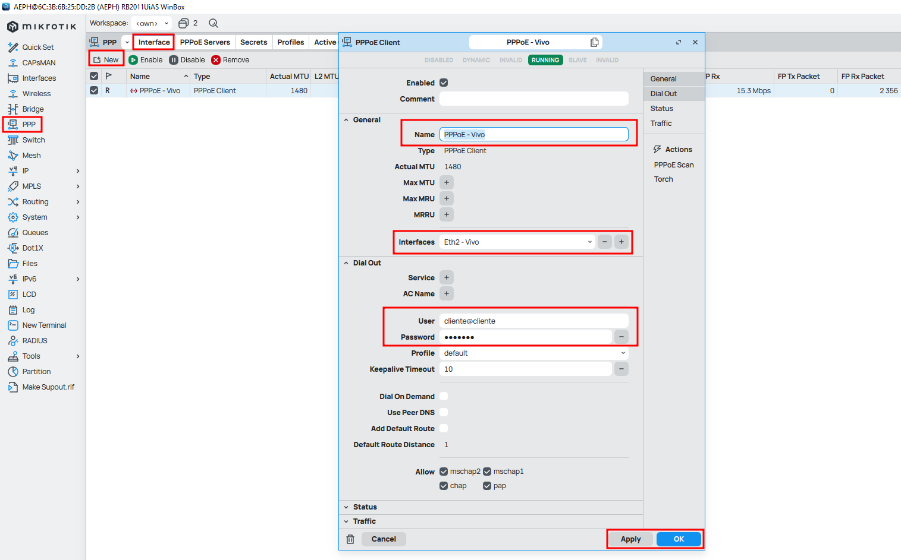

 

[BADGE1]: https://img.shields.io/badge/Página_principal-000?style=for-the-badge&logo=html

<!-- <h1 id="voltar">Voltar para a página principal</h1>

[![backend-simple][BADGE1]](../README.md)-->

 

- 
 <a href="#"> Voltar ao Topo</a>

 

- 
 <a href="../README.md"> Voltar para a página principal</a>
