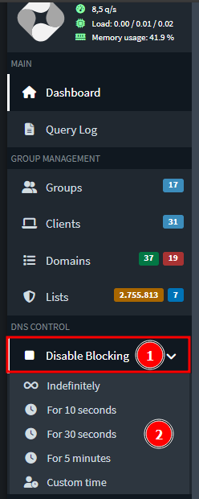
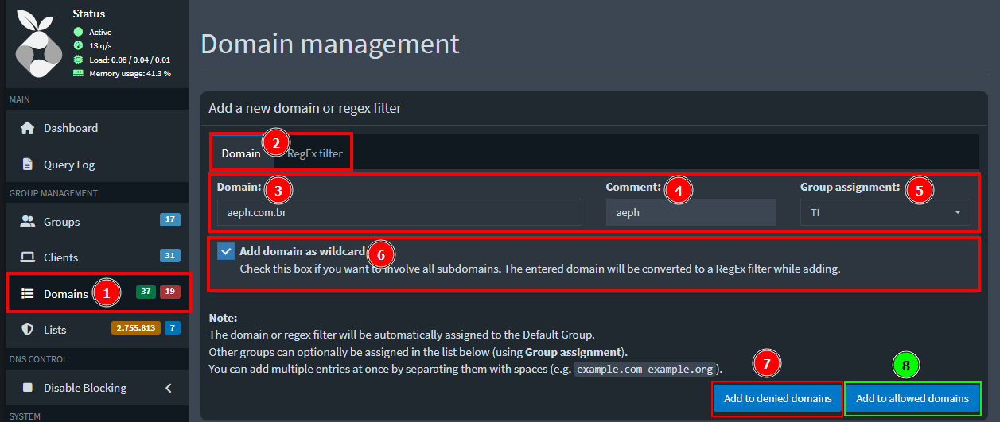
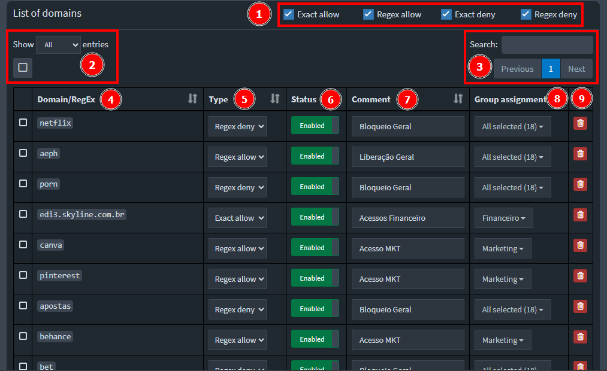
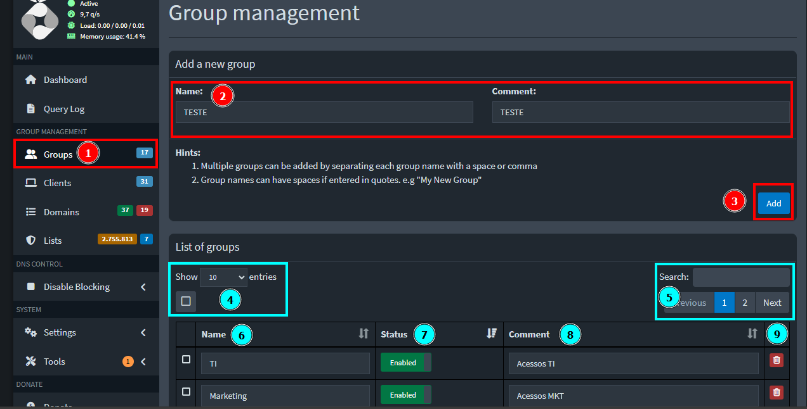
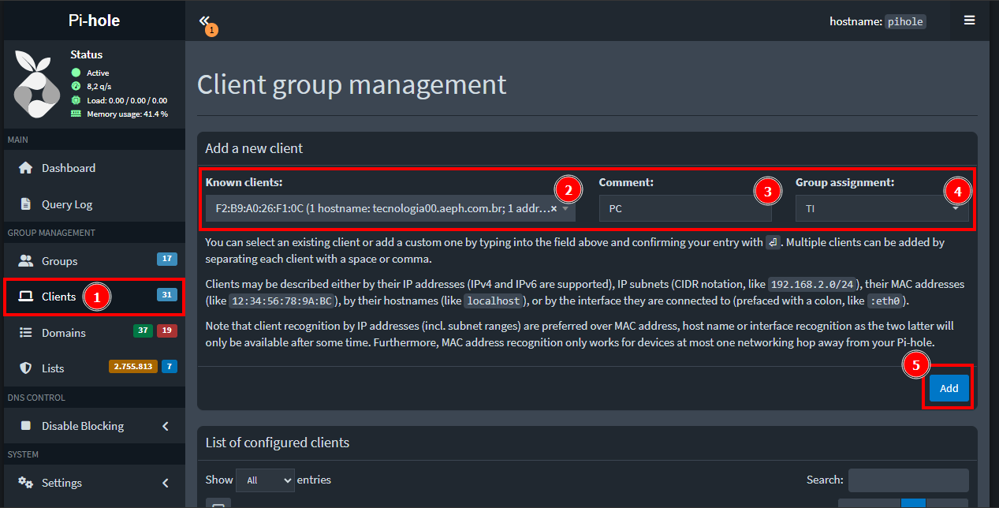
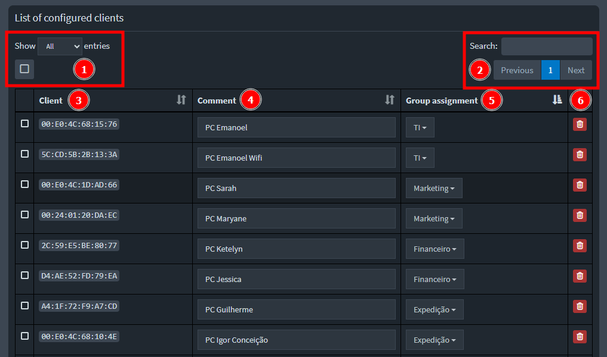
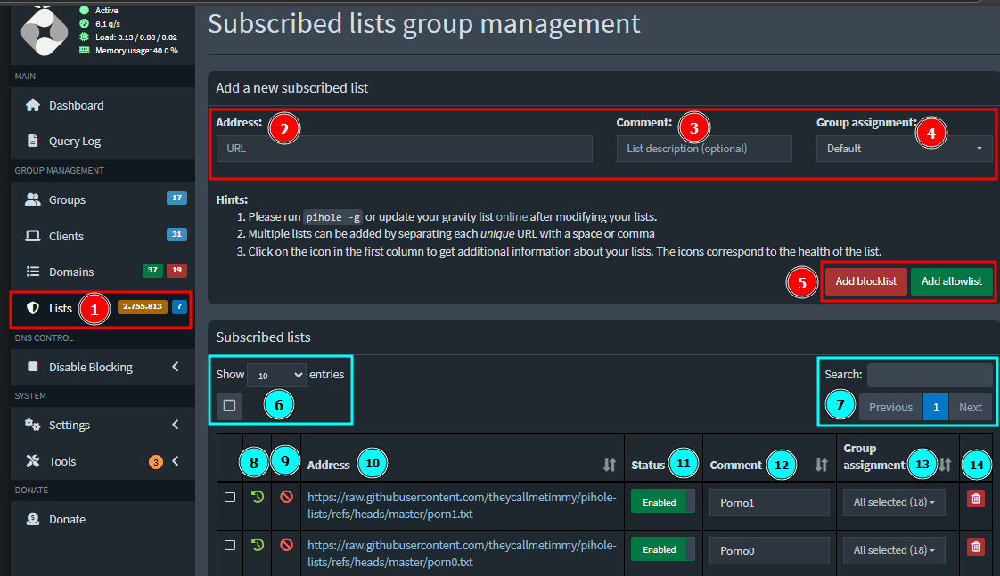

    

<b>Este projeto visa auxiliar o analista nas atividades relacionadas ao PiHole da AEPH do Brasil.</b>

- 
 <a href="#acessopihole"> Pihole - Dashboard: Acesso e Visão Geral</a>

- 
 <a href="#piholelogs"> Pihole - Query Log: Visualização de Logs</a>

- 
 <a href="#piholedisblock"> Pihole - Disable Blocking: Desabilitar Bloqueio</a>

- 
 <a href="#piholewlbl"> Pihole - Domains: Liberação e Bloqueio</a>

- 
 <a href="#piholegrupos"> Pihole - Groups: Administração de Grupos</a>

- 
 <a href="#piholehost"> Pihole - Clients: Administração de Hosts</a>

- 
 <a href="#piholelistas"> Pihole - Lists: Listas de Dominios</a>

<h1 id="acessopihole">🍓 Pihole - Dashboard: Acesso e Visão Geral</h1>

1. 
Acesse a <a href="http://10.0.0.52/admin/login">dashboard do Pihole</a> e faça o login com as credenciais que estão no <b style="color:white; background-color:black">KeePass</b>. 

 

2. 
Na dashboard é possível identificar as seguintes informações:

        1 - Em Vermelho🔴:
            Total de Requisições, Requisições Bloqueadas, Porcentagem Bloqueado, Domínios nas Listas
        2 - Em Amarelo🟡:
            Gráficos de Total de Requisições e Atividade de Host em um intervalo de 24h.
        3 - Em Azul🔵:
            Status do Serviço - Operando, Requisições Por Segundo, Load, Memória em Uso
        4 - Em Rosa🟣:
            Listagem de Menus - Tela Inicial, Logs, Grupos, Hosts, Domínios, Listas
        5 - Em Verde🟢:
            Desativar Bloqueios, Configurações, Ferramenta

 

<h1 id="piholelogs">🍓 Pihole - Query Log: Visualização de Logs</h1>

1. 
Clicando em <b style="color:white; background-color:black">Query Log</b>, você será redirecionado para os Logs de Acesso, com as seguintes informações na tela:

        2 - Horário
        3 - Domínio
        4 - Cliente
        5 - Opção para Realizar Liberação ou Bloqueio de URL
        6 - Ativar Atualização de Logs Automática na Tela
        7 - Buscar Por Domínio
        8 - Buscar Por Host

 

2. 
Clicando em <b style="color:white; background-color:black">Advanced Filtering</b>, poderemos realizar uma busca mais específica, por exemplo, escolher o período que um site foi acesso. No exemplo abaixo, foi utilizado um intervalo de 24h para qualquer acesso ao site aeph.com.br. Com o filtro definido, não esqueça de clicar em <b style="color:white; background-color:black">Refresh</b> para atualizar os logs.

Com isso, o Pihole irá trazer a informação solicitada, desde que tenha registro.

 

<h1 id="piholedisblock">🍓 Pihole - Disable Blocking: Desabilitar Bloqueio</h1>

1. 
<b style="color:white; background-color:black">ATENÇÃO: ESSA OPÇÃO IRÁ DESABILITAR O BLOQUEIO DE TODO O SERVIÇO, OU SEJA, NÃO IRÁ DESATIVAR APENAS PARA UM GRUPO ESPECÍFICO.</b>

Para desativar os bloqueios, clique em <b style="color:white; background-color:black">Disable Blocking</b> no menu, após selecione o período de tempo desejado.

 

<h1 id="piholewlbl">🍓 Pihole - Domains: Liberação e Bloqueio</h1>

1. 
Clicando em <b style="color:white; background-color:black">Domains</b>, você será redirecionado para a tela de controle de dominio. Então, para liberar ou bloquear um acesso, será necessário preencher as seguintes informações:

        2 - Dominio / RegEx - Opção a ser tratada
        3 - Domínio / RegEx que será liberado / bloqueado
        4 - Descrição
        5 - Grupo Designado
        6 - Associar tudo que engloba o dominio escolhido (Apenas para Dominio)
        7 - Efetuar Bloqueio
        8 - Efetuar Liberação

 

2. 
Com a liberação/bloqueio feito, nós poderemos visualizar todos os dominios / RegEx. Então, desça um pouco a tela para localizar a lista de dominios:

        1 - Filtragem Por Tipo
        2 - Alterar a QTD de Entradas Listadas  / Marcar Todas as Linhas
        3 - Busca / Mudar Pagínas
        4 - Domínio / RegEx
        5 - Tipo
        6 - Status
        7 - Descrição
        8 - Grupo Designadado
        9 - Excluir

 

<h1 id="piholegrupos">🍓 Pihole - Groups: Administração de Grupos</h1>

1. 
Clicando em <b style="color:white; background-color:black">Groups</b>, você será redirecionado para a tela de administração de grupos. Então, para adicionar um novo grupo, será necessário preencher as seguintes informações:

        2 - Nome do Grupo / Descrição
        3 - Adicionar Grupo

Agora com o grupo adicionado, poderemos visualizar todos abaixo na mesma tela. Na lista de grupos, temos as seguintes informações:

        4 - Alterar a QTD de Entradas Listadas  / Marcar Todas as Linhas
        5 - Busca / Mudar Pagínas
        6 - Nome do Grupo
        7 - Status
        8 - Descrição
        9 - Excluir

 

<h1 id="piholehost">🍓 Pihole - Clients: Administração de Hosts</h1>

1. 
Clicando em <b style="color:white; background-color:black">Clientes</b>, você será redirecionado para a tela de administração de hosts. Então, para adicionar um novo, será necessário preencher as seguintes informações:

        2 - Selecionar o Host Baseado no IP, MAC Address ou Hostname
        3 - Descrição
        4 - Grupo Associado
        5 - Adicionar

 

2. 
Agora com o host adicionado, poderemos visualizar todas entradas abaixo na mesma tela. Nesta lista, temos as seguintes informações:

        1 - Alterar a QTD de Entradas Listadas  / Marcar Todas as Linhas
        2 - Busca / Mudar Pagínas
        3 - Host
        4 - Descrição
        5 - Grupo Associado
        6 - Excluir

 

<h1 id="piholelistas">🍓 Pihole - Lists: Listas de Dominios</h1>

1. 
Clicando em <b style="color:white; background-color:black">Lists</b>, você será redirecionado para a tela de inscrição e administração de listas. Então, para adicionar uma nova, será necessário preencher as seguintes informações:

        2 - URL da lista
        3 - Descrição
        4 - Grupo Associado
        5 - Adicionar como Bloqueio ou Liberação
        6 - Alterar a QTD de Entradas Listadas  / Marcar Todas as Linhas
        7 - Busca / Mudar Pagínas
        8 - Lista Atualizada Ou Não
        9 - Tipo - Bloqueio / Liberação
        10 - URL da lista
        11 - Status
        12 - Descrição
        13 - Grupo Designado
        14 - Excluir

 

- 
 <a href="#"> Voltar ao Topo</a>

 

- 
 <a href="../README.md"> Voltar para a página principal</a>
