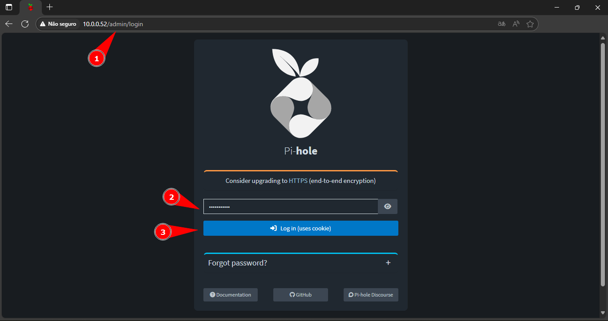
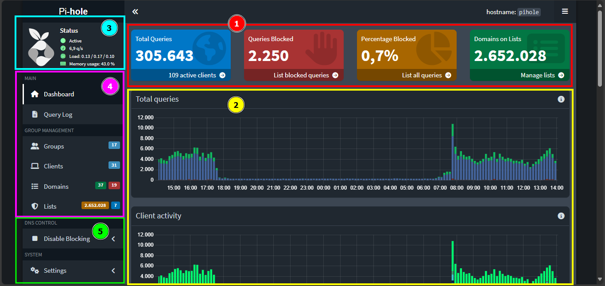

    

<b>Este projeto visa auxiliar o analista nas atividades relacionadas ao PiHole da AEPH do Brasil.</b>

- 
 <a href="#acessopihole"> Pihole: Acesso e Visão Geral</a>

- 
 <a href="#piholelogs"> Pihole: Visualização de Logs</a>

<h1 id="acessopihole">🍓 Pihole: Acesso e Visão Geral</h1>

1. 
Acesse a <a href="http://10.0.0.52/admin/login">dashboard do Pihole</a> e faça o login com as credênciais que estão no <b style="color:white; background-color:black">KeePass</b>. 

 

2. 
Na dashboard é possível identificar as seguintes informações:

        1 - Em Vermelho🔴:
            Total de Requisições, Requisições Bloqueadas, Porcentagem Bloqueado, Domínios nas Listas
        2 - Em Amarelo🟡:
            Gráficos de Total de Requisições e Atividade de Host em um intervalo de 24h.
        3 - Em Azul🔵:
            Status do Serviço - Operando, Requisições Por Segundo, Load, Memória em Uso
        4 - Em Rosa🟣:
            Listagem de Menus - Tela Inicial, Logs, Grupos, Hosts, Domínios, Listas
        5 - Em Verde🟢:
            Desativar Bloqueios, Configurações, Ferramenta

 

<h1 id="acessopihole">🍓 Pihole: Visualização de Logs</h1>

1. 
Clicando em <b style="color:white; background-color:black">Query Log</b>, você será redirecionado para os Logs de Acesso, com as seguintes informações na tela:

        2 - Horário
        3 - Domínio
        4 - Cliente
        5 - Opção para Realizar Liberação ou Bloqueio de URL
        6 - Ativar Atualização de Logs Automática na Tela
        7 - Buscar Por Domínio
        8 - Buscar Por Host

 

2. 
Clicando em <b style="color:white; background-color:black">Advanced Filtering</b>, poderemos realizar uma busca mais específica, por exemplo, escolher o período que um site foi acesso. No exemplo abaixo, foi utilizado um intervalo de 24h para qualquer acesso ao site aeph.com.br. Com o filtro definido, não esqueça de clicar em <b style="color:white; background-color:black">Refresh</b> para atualizar os logs.

Com isso, o Pihole irá trazer a informação solicitada, desde que tenha registro.

 

- 
 <a href="#"> Voltar ao Topo</a>

 

- 
 <a href="../README.md"> Voltar para a página principal</a>
