

    

<b>Este projeto visa auxiliar o analista nas atividades relacionadas a Rede Interna da AEPH do Brasil.</b>

<!-- Comentário exemplo -->

<h1 id="conteudo" style="font-size:35px;">📝 Conteúdo</h1>

<!-- - 
 <a href="#criartronco"> Criação de Tronco: Asterisk</a>
 -->
- 
 <a href="#aduser"> AD: Criação de Usuário</a>

- 
 <a href="#adgroup"> AD: Criação de Grupo</a>

- 
 <a href="#pastarede"> Compartilhamento de Pasta</a>

 

<h1 id="aduser">🖥️ AD: Criação de Usuário</h1>

1. 
Acessando o AD, vá em <b style="color:white; background-color:black">Usuários e Computadores do Active Driectory</b>. Nesta tela de administração de usuários, grupos e computadores do AD, clique na seguinte ordem, para listar os usuários:

        1 - aeph.com.br
        2 - AEPH
        3 - Usuários

No quadrante de número 4, está a listagem de usuários do AD.

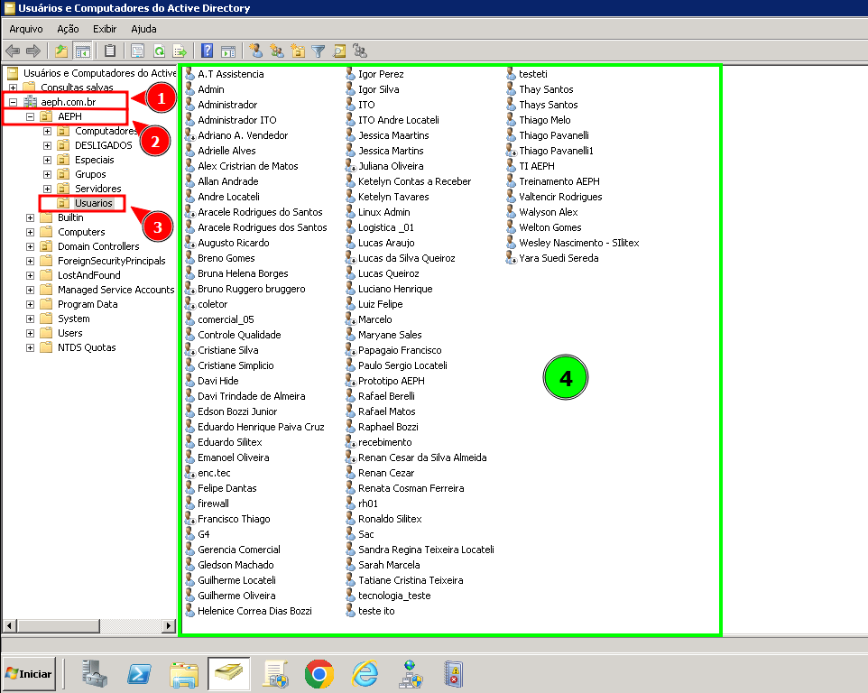

 

2. 
Então, para criar um novo usuário, clique com o botão direito do mouse e vá em Novo Usuário.

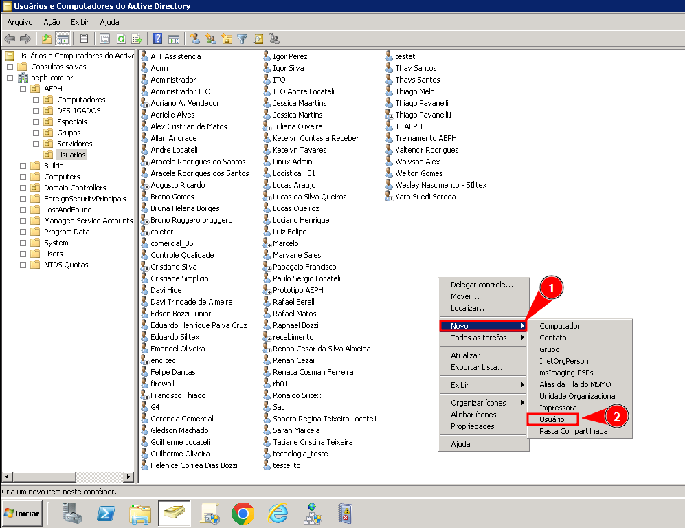

 

3. 
Preencha as informações de acordo e não se esqueça de clicar em avançar.

 

4. 
Nesta dela, será definida a senha e configurações adicionais sobre a conta, então preencha de acordo com a necessidade. Para finalizar a criação de usuário, revise as informações e clique em Concluir.

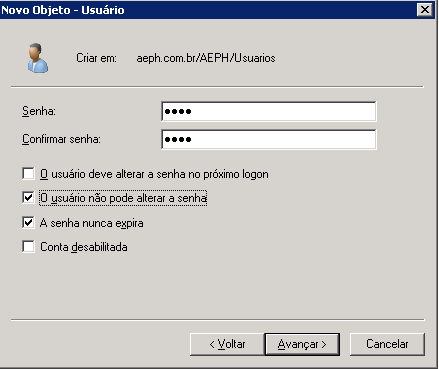

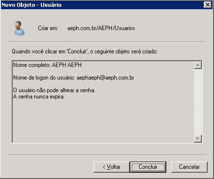
 

5. 
 Para alterar a senha, adicionar o usuário a um grupo, desativar conta, excluir usuário ou ver as propriedades do mesmo, basta clicar com o botão direito em cima do mesmo.

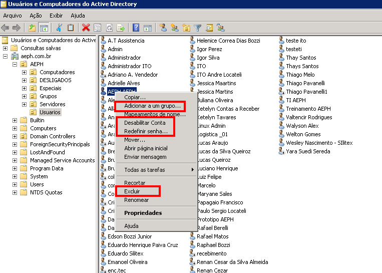

 

<h1 id="adgroup">🖥️ AD: Criação de Grupo</h1>

1. 
Em <b style="color:white; background-color:black">Usuários e Computadores do Active Driectory</b>. Siga o seguinte caminho, para listar os grupos:

	1 - aeph.com.br
        2 - AEPH
        3 - Grupos

No quadrante de número 4, está a listagem de grupos do AD.

 

2. 
Então, para criar um novo grupo, clique com o botão direito do mouse e vá em Novo Grupo.

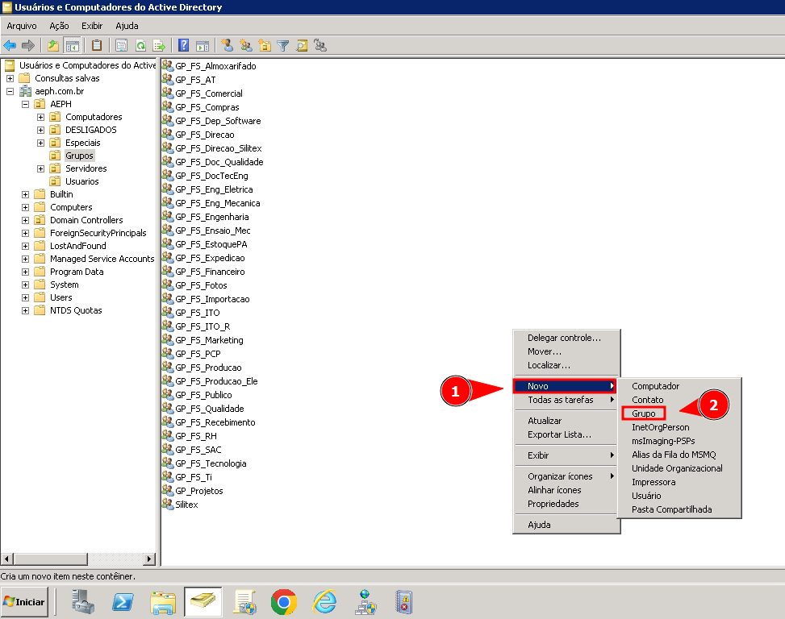

 

3. 
Preencha as informações de acordo e não se esqueça de clicar em Ok.

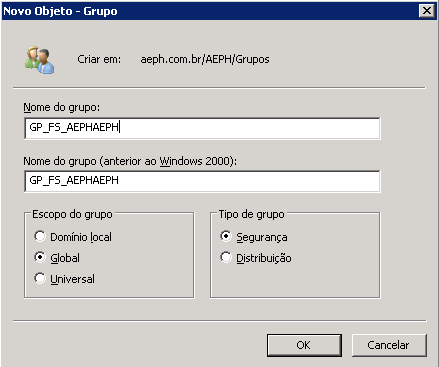

 

4. 
 Para adicionar um usuário a um grupo, excluir grupo ou ver as propriedades do mesmo, basta clicar com o botão direito em cima do mesmo. Então, para adicionar um novo usuário ao grupo, vamos clicar em Propriedades.

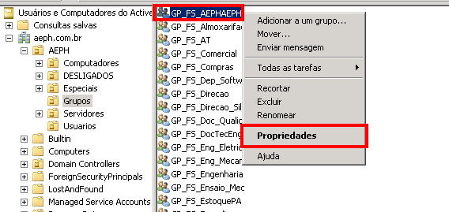

 

5. 
 Em propriedades, faça o seguinte passo a passo:

        1 - Membros
        2 - Adicionar
        3 - Digite o usuário/host
        4 - Clique em Verificar nomes
        5 - Ok
        6 - Ok

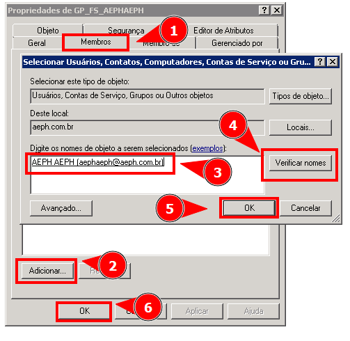

 

<h1 id="pastarede">🖥️ Compartilhamento de Pasta</h1>

1. 
Para compartilhar uma pasta na rede, devemos fazer o seguinte procedimento:

Clique com o botão direito do mouse na pasta que deverá ser compartilhada, após clique em propriedades.

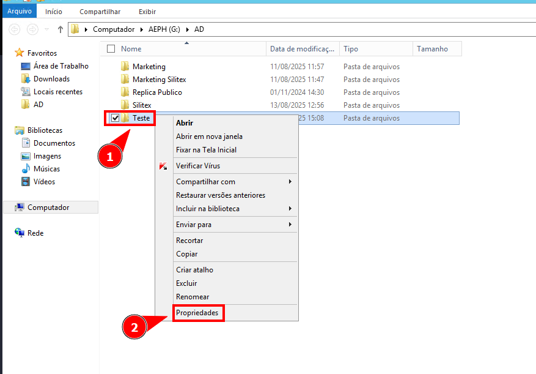

 

2. 
Em propriedades. siga o passo a passo abaixo:

        🔴
        1 - Compartilhamento.
        2 - Compartilhamento Avançado
        🟢
        3 - Marque Compartilhar a Pasta
        4 - Nomeie o Compartilhamento
        5 - Clique em Permissões
        🟣
        6 - Adicionar/Remover
        7 - Coloque o usuário ou grupo
        8 - Defina as Permissões
        9 - Aplicar e Ok

Essa etapa é fundamental, pois iremos definir quem poderá percorrer a pasta. Então, caso um usuário ou grupo não esteja na relação, não poderá nem acessar a pasta. No próximo passo, vamos definir a segurança da pasta. Portanto, vamos definir se o usuário/grupo terá alguma permissão especial, por exemplo, apenas leitura.

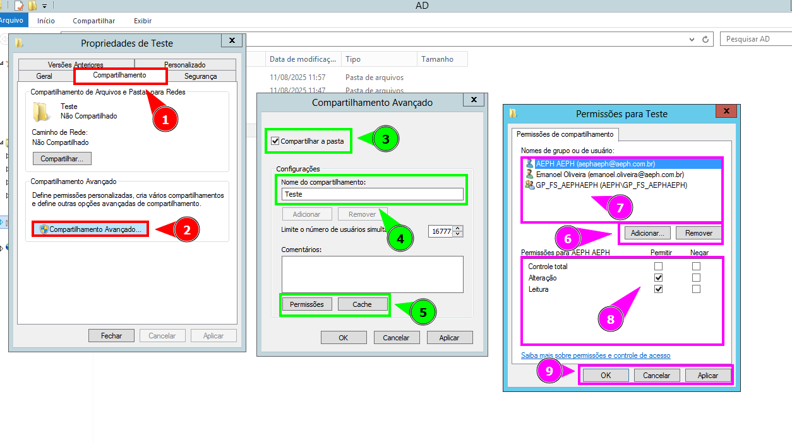

 

3. 
 Na aba <b style="color:white; background-color:black">Segurança</b>, clique em Avançadas para ter uma visão ampla das configurações:

Agora na Tela de Configurações de Segurança Avançadas da Pasta, devemos mexer na aba de <b style="color:white; background-color:black">Permissões</b>. Nela podemos visualizar todos usuários/grupos e suas configurações de acesso, além de habilitar ou desativar herança.

Neste exemplo, vamos desabilitar a herança e permitir que o usuário emanoel.oliveira tenha Controle total apenas a pasta Teste, conforme imagem abaixo:

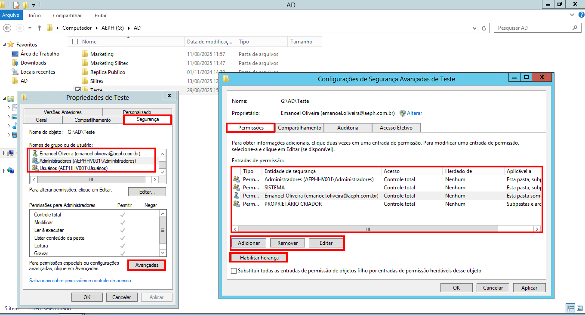

 

4. 
 Agora dentro da pasta Teste, vamos negar o acesso do usuário emanoel.oliveira para a pasta <b style="color:white; background-color:black">Teste2</b>, então nas configurações de segurança, vamos adicionar uma Negação Total ao usuário, conforme imagem abaixo, atente-se que a herança deve estar desabilitada, pois caso esteja ativa o usuário poderá receber outra configuração proveniente da pasta raiz.

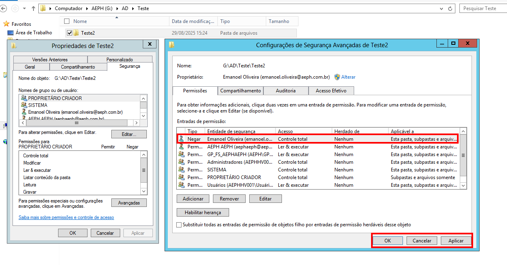

 

5. 
 Com as configurações de acesso realizada, podemos notar que o usuário em questão consegue acessar sem problemas a pasta Teste, porém o mesmo não tem permissão para acessar a pasta Teste2.

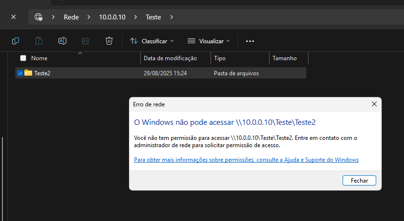

 

- 
 <a href="#"> Voltar ao Topo</a>

 

- 
 <a href="../README.md"> Voltar para a página principal</a>
