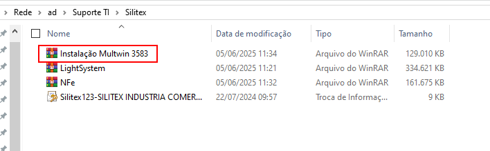
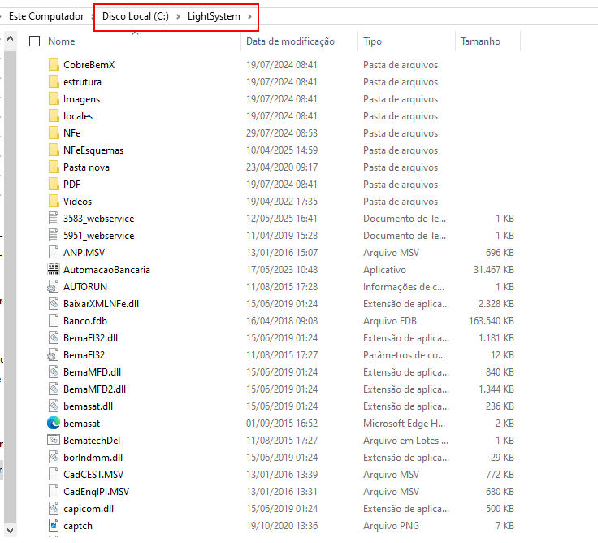
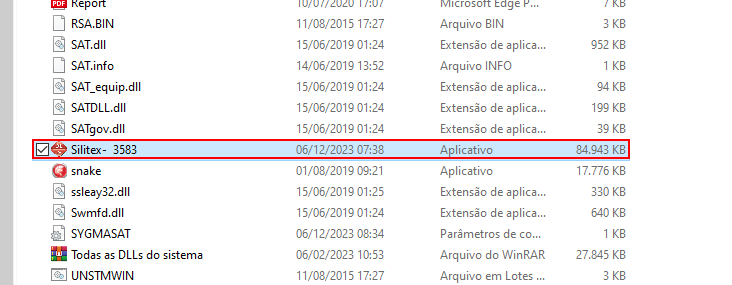
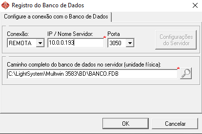
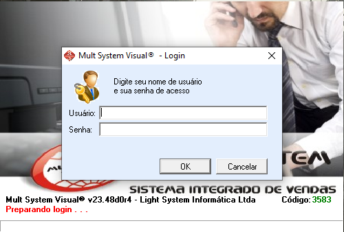

    

<b>Este projeto visa auxiliar o analista nas atividades relacionadas a Silitex, empresa do grupo AEPH do Brasil.</b>

<!-- Comentário exemplo -->

<h1 id="conteudo" style="font-size:35px;">📝 Conteúdo</h1>

- 
 <a href="#instalacaomultiwin"> Instalação MultiWin</a>

- - 
 <a href="#gerarnfesilitex"> Instalação Para Gerar NF-e</a>

<h1 id="instalacaomultiwin">⚗️ Instalação MultiWin</h1>

1. 
Para instalar o sistema da Silitex, vamos precisar do zip: <b style="color:white; background-color:black">Instalação Multwin 3583</b> que está localizado na seguinte pasta:

        \\\ad\Suporte TI\Silitex

 

2. 
Agora vamos até o <b style="color:white; background-color:black">Disco C</b> (pode mudar dependendo da configuração do host), crie uma pasta com nome de <b style="color:white; background-color:black">LightSystem</b> e cole/extraia o programa que copiamos da Silitex:

 

3. 
 Com o programa dentro da pasta, procure pelo atalho/aplicativo <b style="color:white; background-color:black">Silitex - 3583</b> e crie um atalho na área de trabalho.

4. 
 Agora execute o sistema, defina a Conexão como <b style="color:white; background-color:black">Remota</b> e altere o IP para: <b style="color:white; background-color:black">10.0.0.193</b> finalizando com OK.

 

5. 
 Por fim, autentique-se e clique em <b style="color:white; background-color:black">OK</b> para usar o sistema.

 

<h2 id="gerarnfesilitex">⚗️ Instalação Para Gerar NF-e</h2>

1. 
 Para utilizar o sistema para gerar NF-e, será necessário o uso do certificado da Silitex, que está armazenado tanto na pasta da rede ou no keepass.

        \\\ad\Suporte TI\Silitex

 

2. 
 Com a senha e certificado em "mãos", será necessário ligar ao suporte do Multiwin, pois há algumas DLL que precisam ser instaladas para que seja possível gerar as NF-e. O telefone do suporte é o seguinte: <b style="color:white; background-color:black">(11) 4063-1884</b>.

 

- 
 <a href="#"> Voltar ao Topo</a>

 

- 
 <a href="../README.md"> Voltar para a página principal</a>
