

    

<b>Este projeto visa auxiliar o analista nas atividades relacionadas a telefonia da AEPH do Brasil.</b>

<!-- Comentário exemplo -->

<h1 id="conteudo" style="font-size:35px;">📝 Conteúdo</h1>

<!-- - 
 <a href="#criartronco"> Criação de Tronco: Asterisk</a>
 -->
- 
 <a href="#acessopabx"> Acesso ao PABX: Asterisk</a>

- 
 <a href="#criarramal"> Criação Ramal e Inserção no Grupo: Asterisk</a>

- 
 <a href="#VoIPs"> Configuração VoIPs</a>

- 
 <a href="#resolucaoproblemas"> Resolução de Problemas</a>

<h1 id="acessopabx">🖥 Acesso ao PABX: Asterisk</h1>

1. 
Para acessar o PABX, basta ir no cmd (ou qualquer ferramenta de linha de comando) e logar no <b>10.0.0.31</b> com o usuário root, neste caso do cmd do windows, utilizamos: <b style="color:white; background-color:black">ssh root@10.0.0.31</b>. A senha está armazenada no keepass.

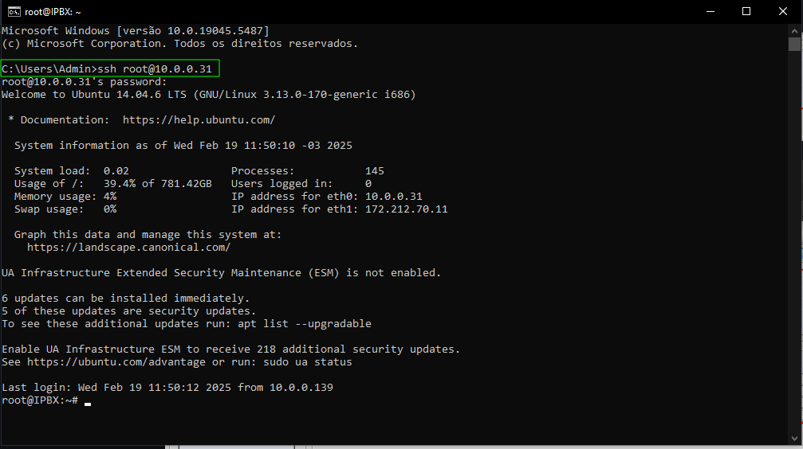

 

<h1 id="criarramal">🖥 Criação Ramal e Inserção no Grupo: Asterisk</h1>

1. 
Dentro do PABX, vá até a pasta de configuração do Asterisk com o comando: 
<i>

	cd /etc/asterisk
</i> 

Após rode o comando: 

<i>

	nano sip.conf
</i> 

ou

<i>

	vi sip.conf

</i> Para editarmos o arquivo de configuração de Tronco/Ramais.

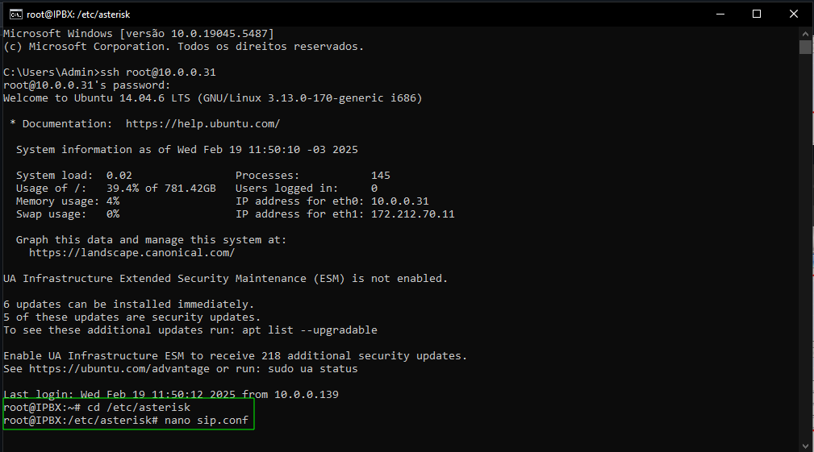

 

2. 
No arquivo de configuração, adicione um novo ramal seguindo a configuração abaixo: 
<i>

	[NumeroRamal]
	type=friend
	username=NumeroRamal
	secret=NumeroRamal
	disallow=all
	allow=g729,alaw,ulaw
	context=ramais_11
	host=dynamic
	dtmfmode=rfc2833
	canreinvite=yes
	nat=yes                                   
	qualify=yes
	callgroup=1
	pickupgroup=1
	call-limit=3
	accountcode=NumeroRamal

</i> Lembre-se de seguir a concatenação

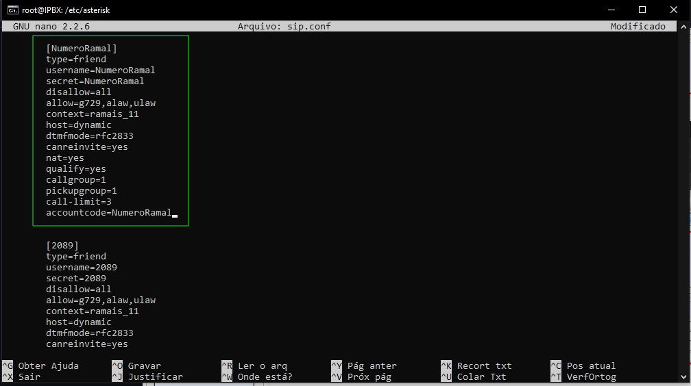

 

Com o novo ramal inserido, devemos salvar as alterações no arquivo com: <b style="color:white; background-color:black">CTRL X: S: CTRL X ou também com CTRL O: CTRL X</b>.

3. 
Agora devemos mexer no arquivo <b>queues.conf</b> para inserir o novo ramal em um grupo. Para isso, rode o comando abaixo:
    
<i>
	
	nano queues.conf  
</i>

ou

<i>

	vi queues.conf

</i>

4. 
Dentro do arquivo, podemos notar que todos os grupos de ramais da AEPH  estão localizados dentro deles. Então, localize o grupo que deseja inserir o ramal novo. Neste exemplo, vamos utilizar o grupo de ramais da ITO, então para fácil localização de grupos. Dê <b style="color:white; background-color:black">CTRL W e busque por 2089, por exemplo</b>. No grupo adicione o novo ramal e finalize com: <b style="color:white; background-color:black">CTRL X: S: CTRL X ou também com CTRL O: CTRL X</b>.

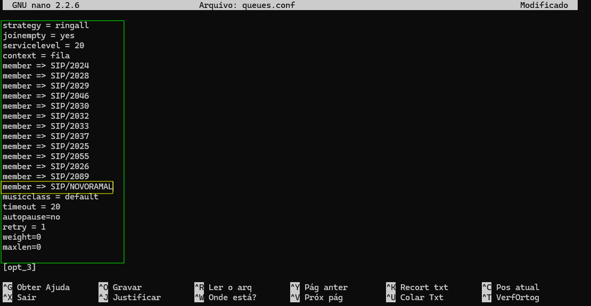

<!-- 
<i>
	<b>service asterisk reload ou sudo asterisk -rx</b>
</i>
-->

 

<h1 id="VoIPs">☎️ Configuração de VoIP</h1>

1. 
No telefone, clique em MENU e procure por <b>STATUS</b>, dê <b>ENTER</b> e mais uma vez em <b>NETWORK STATUS</b>. Agora desça pelas informações até localizar o IP que o telefone recebeu e guarde essa informação, pois vamos precisar dela para realizar a configuração do ramal.

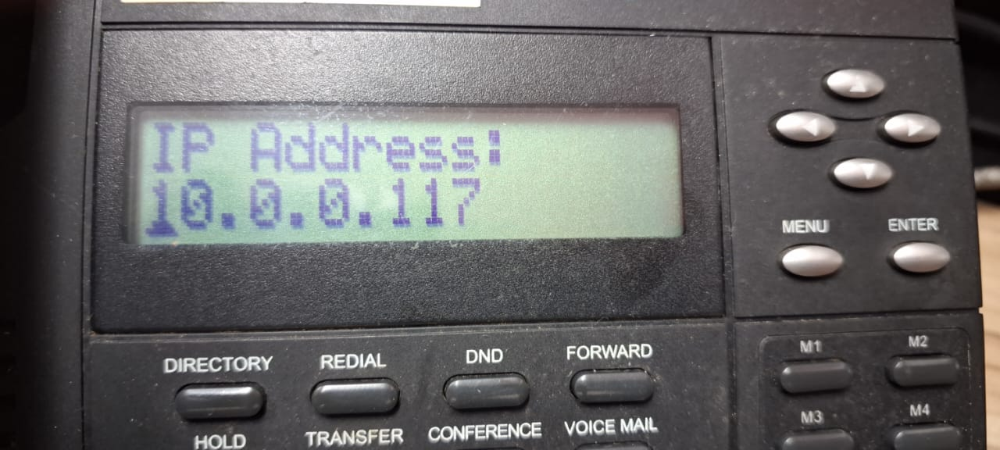

 

2. 
No navegador, coloque o IP obtido e preencha o campo de login com os dados armazenados no Keepass.

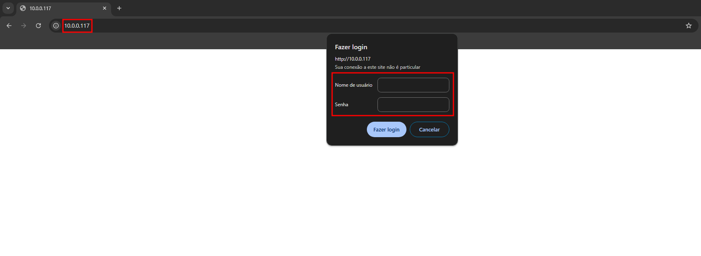

 

3. 
Já dentro do VoIP, vá na aba <b style="color:white; background-color:black">Configuration: Quick Setup</b> e preencha cada aba com as seguintes informações:
- LAN SETUP:
- - Caso preferir deixar como DHCP, não será necessário alterar a configuração. Porém, se for IP estático, coloque as informações de rede de acordo com a rede da AEPH.
- SIP Proxy and Register
- - Enable, IPservidorPABX (10.0.0.31), porta (5060), Disable, Enable, IPservidorPABX  (10.0.0.31), porta (5060).
- Line Settings
- - 1, Enable, NomeDisplayDeLigação, NúmeroRamal, UsuárioAutenticaçãoDoPABX, SenhaDeUsuárioPABX (por padrão o mesmo que o nome de usuário).

Após realizar as configurações, basta clicar em <b style="color:white; background-color:black">Submit</b>, no canto inferior direito da tela e validar a efetuação e recebimentos de ligações..

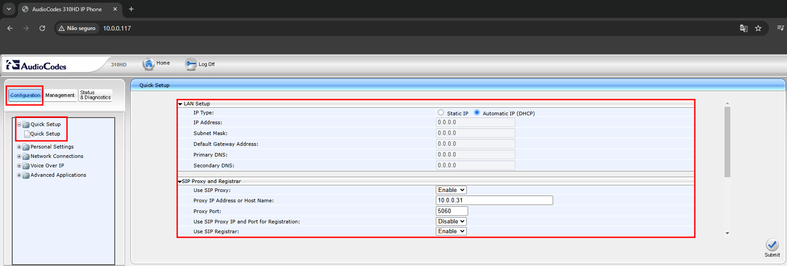
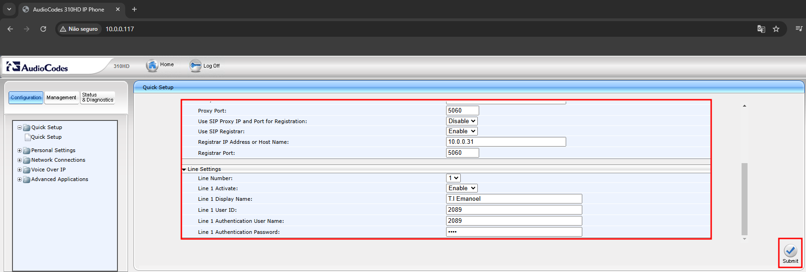

 

<h1 id="resolucaoproblemas">🖥 Resolução de Problemas</h1>

 <a href="#rebootasterisk"> Reboot: Asterisk</a>

 <a href="#filesasterisk"> Too Many Open Files</a>

<h2 id="rebootasterisk">🖥 Reboot: Asterisk</h2>

1. 
Caso o PABX (Asterisk), comece a apresentar problemas de ligações ou a URA em inglês, devemos realizar o procedimento de reboot do serviço. Logado no servidor, rode o comando <b><i>rasterisk</i></b>, note que no exemplo abaixo, há dois erros de TIMEOUT de registro do servidor localizado na GTGI. Mas, pode ser que não seja retornado nenhuma mensagem de erro.

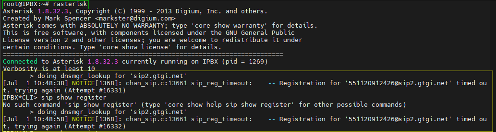

 

2. 
Rodando o comando:
<i>

	sip show registry
</i>
Podemos notar também o erro de registro relatado no passo anterior.

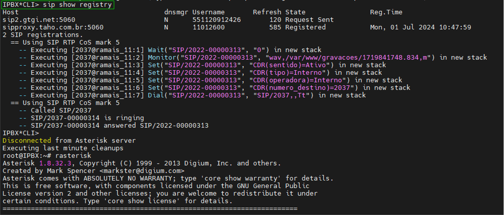

 

3. 
Agora devemos parar o serviço do asterisk, então rode:
<i>

	core stop now
</i>
Para desabilitar o serviço de telefonia.

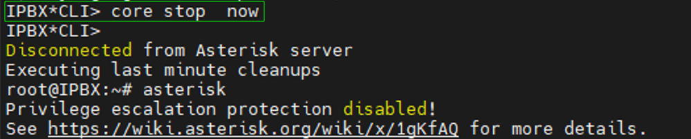

 

4. 
<i>(OPCIONAL)</i> Para termos certeza que todas conexões do asterisk, foram encerradas, podemos derrubar todas conexões via Mikrotik.<b><i> 
ATENÇÃO, O PROCEDIMENTO IRÁ DERRUBAR A CONEXÃO DE INTERNET DA AEPH POR ALGUNS INSTANTES, ENTÃO REALIZE ESSE PASSO QUANDO FOR TOTALMENTE NECESSÁRIO E COM PERMISSÃO DE SEU SUPERIOR</i></b>. 

Já logado no mikrotik, vá em <b style="color:white; background-color:black">IP: Firewall: Connections</b>, então dê um <b style="color:white; background-color:black">CTRL A</b> para selecionar todos os STATES e clique no sinal de <b style="color:white; background-color:black">- (podendo ser <i>Remove</i>, dependendo da versão que está utilizando)</b>, repita esse processo duas vezes!

 

5. 
Com o servidor de telefonia parado, vamos inicia-lo com o seguinte comando:

<i>

	service asterisk start
</i>

6. 
Com o Asterisk iniciado, volte para a linha de comando do servidor com o comando:
 <i>
 
 	rasterisk

 </i>
Após dê:
<i>

	sip show registry
</i>

Assim já será possível identificar ambos hosts registrados e em funcionamento. Caso preferir, pode ficar nesta tela e ver os logs de ligações subindo.

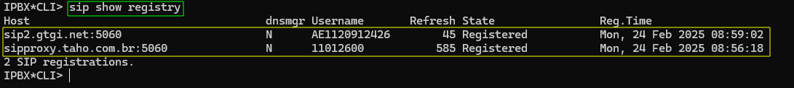

 

<h2 id="filesasterisk">🖥 Too Many Open Files</h2>

1. 
Caso o PABX (Asterisk), pare de funcionar é possível que este problema esteja relacionado ao limite de arquivos gerados. Então, para podermos confirmar se este é o problema, devemos análisar as linhas de Logs. Dentro da linha de comando do servidor, utilize o comando abaixo, para acessarmos a pasta de logs:

	 cd /var/log/asterisk

Agora podemos fazer a leitura do arquivos de logs <b style="color:white; background-color:black">messages.log</b>, para isso rode o comando abaixo:

	cat messages

Irá mostrar na tela os logs mais recentes do Asterisk, então espere chegar até o dia e horário que deseja, após pare o comando com <b style="color:white; background-color:black">Ctrl+C</b>. Note também que é possível utilizar o comando <b style="color:white; background-color:black">grep</b> para auxiliar na busca.

	cat messages | grep -i 'TermoDeBusca'

Desta maneira só irá listar o que tiver de acordo com o termo buscado.

	cat messages | grep -iv 'TermoNãoDesejado'

Assim irá mostrar tudo, exceto o termo informado.

 

Com a leitura e análise dos logs realizada, você deverá encontrar uma linha como a imagem abaixo:

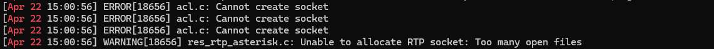

 Conseguimos notar que de fato está ocorrendo uma criação excessiva de arquivos, impedindo o servidor de funcionar corretamente.
 

2. 
Agora devemos editar o arquivo de configuração do pabx, o <b style="color:white; background-color:black">asterisk.conf</b>. Nele procure pela linha que contêm: <b style="color:white; background-color:black">maxfiles</b>. O valor por padrão será 100, mas no nosso caso queremos aumentar esse valor, então definaremos o valor que quisermos, neste caso iremos utilizar 10000.
Então, para isso edite o arquivo de configuração com o seguinte comando:

	nano asterisk.conf

 Após, salve o arquivo com <b style="color:white; background-color:black">Ctrl+O</b> e saia da edição do mesmo.

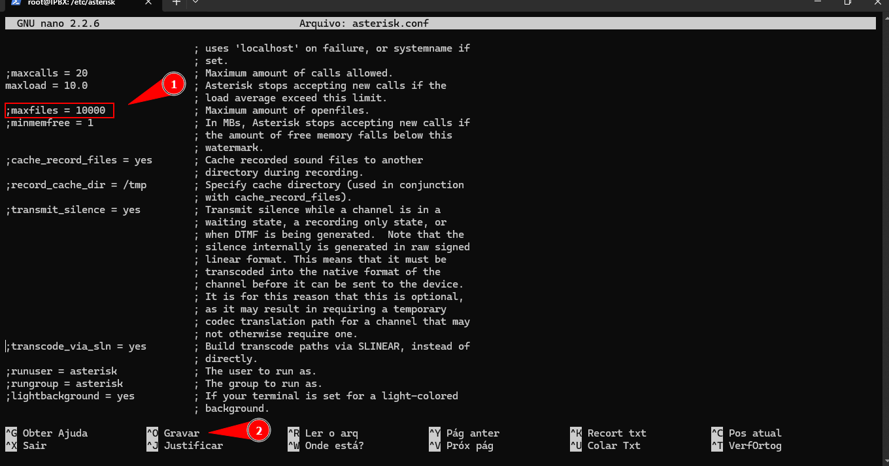

 

3. 
 Para finalizar, reinicie o serviço de telefonia, com o comando abaixo:

		service asterisk restart

 

 

- 
 <a href="#"> Voltar ao Topo</a>

 

- 
 <a href="../README.md"> Voltar para a página principal</a>
