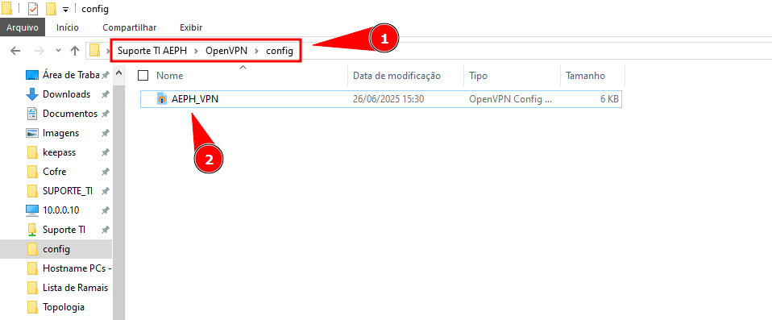
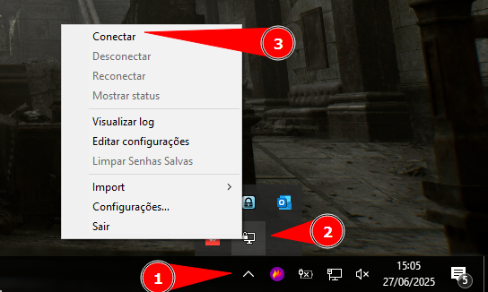
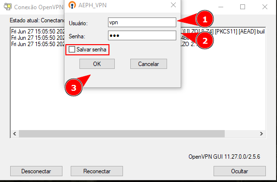
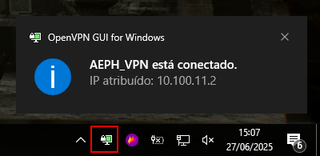
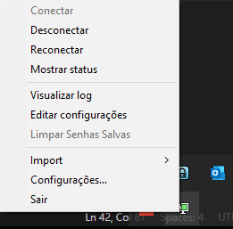

    

<b>Este projeto visa auxiliar o analista nas atividades relacionadas a VPN da AEPH do Brasil.</b>

<!-- Comentário exemplo -->

<h1 id="conteudo" style="font-size:35px;">📝 Conteúdo</h1>

- 
 <a href="#instalacaovpn"> Instalação VPN</a>

<h1 id="instalacaovpn">🔐 Instalação VPN</h1>

1. 
Iremos utilizar o programa <b style="color:white; background-color:black">OpenVPN</b> para se conectar na VPN da AEPH. O programa estará localizado na seguinte pasta:

        \\ad\Suporte TI\Silitex

Ou clique no seguinte link e faça o <a href="https://openvpn.net/community/">download</a> do programa.

 

2. 
Agora vamos ter que  enviar o arquivo de VPN para a pasta do OpenVPN GUI. Para isso copie o arquivo: <b style="color:white; background-color:black">AEPH_VPN.ovpn</b> que estará localizado na seguinte pasta:

        \\ad\Suporte TI\Silitex

 

3. 
 Com o arquivo copiado vá até a pasta do OpenVPN no seu computador e cole-o nela, o caminho deve ser parecido com esse:

        C:\Users\suporte_ti\OpenVPN\config

 

4. 
 Agora execute o programa <b style="color:white; background-color:black">OpenVPN GUI</b>, que estará 'escondido' no canto inferior direito da barra de tarefas. Então, clique na <b style="color:white; background-color:black">Seta para Cima</b>, clique com o botão direito do mouse sobre o icone do programa e clique em <b style="color:white; background-color:black">Conectar</b>

 

5. 
 Será aberto duas janelas para conexão na VPN, portanto coloque seu Usuário e Senha, se preferir pode deixar a senha salva já no programa para se conectar automaticamente da próxima vez, que for utilizar o túnel de VPN. Finalize clicando no <b style="color:white; background-color:black">OK</b>

 

6. 
 Caso não tenha nenhum problema, o computador irá mostrar uma mensagem de conexão sucedida no canto inferior direito da tela. E a tela do OpenVPN estará <b style="color:white; background-color:green">Verde</b>

 

7. 
 Se quiser desconectar o computador ou até mesmo reconectar, clique com botão direito novamente sobre o icone de VPN. Nisso você terá também a possibilidade ler os logs ou editar as configurações do arquivo ovpn.</b>

 

- 
 <a href="#"> Voltar ao Topo</a>

 

- 
 <a href="../README.md"> Voltar para a página principal</a>
